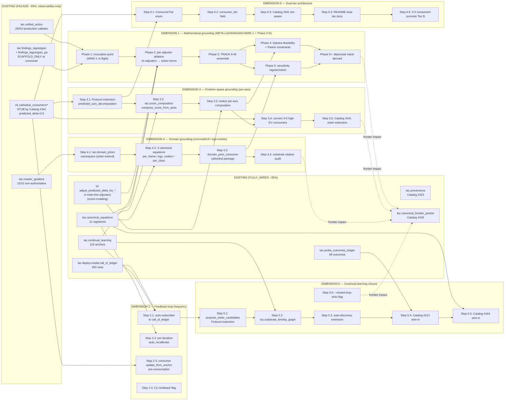
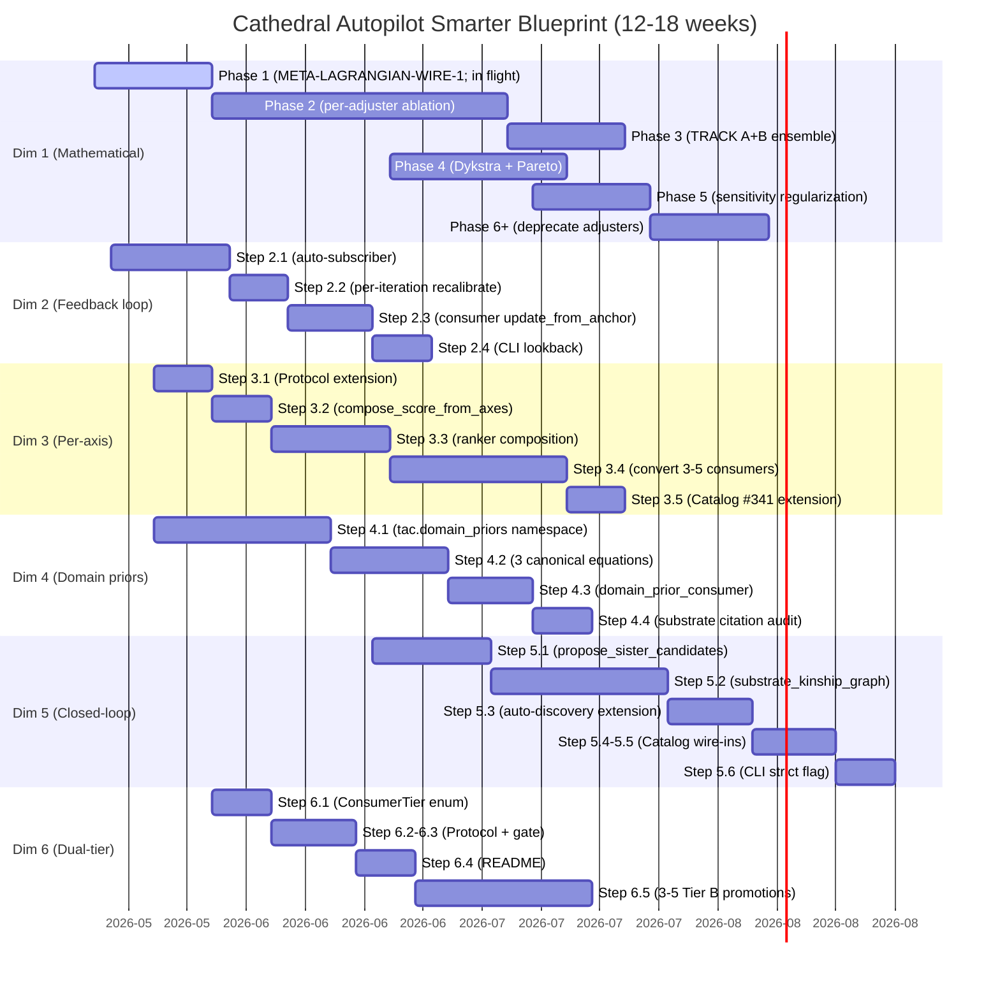
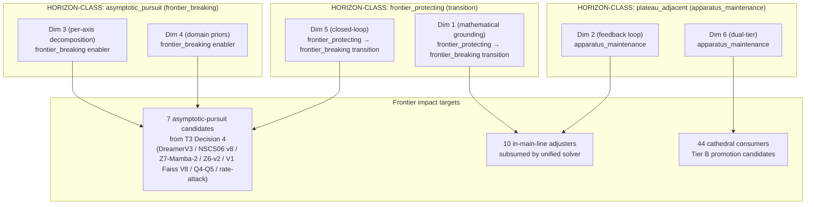
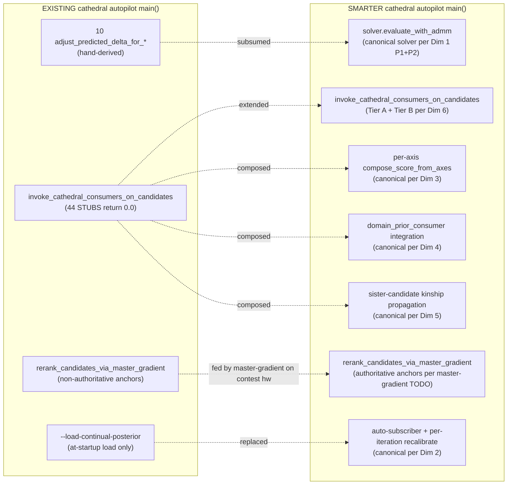
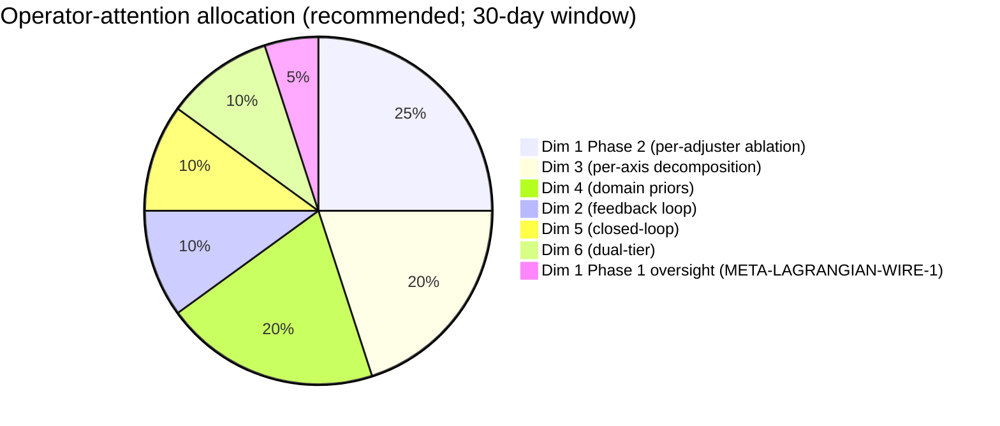

# Cathedral Autopilot Smarter Dependency Graph — 2026-05-20T13:03:25Z

> **Deliverable B (dependency graph) of SLOT CATHEDRAL-SMARTER-DESIGN-MEMO**
> **Lane**: `lane_cathedral_autopilot_smarter_design_blueprint_20260520`
> **Cite-chain**: master memo `cathedral_autopilot_smarter_design_blueprint_20260520T130325Z.md` + cost envelope sister

---

## Graph 1 — 6-dimension critical-path topology

## Graph 2 — 6-hook wire-in coverage per dimension

```mermaid
graph TD
  subgraph "Hook 1: Sensitivity-map"
    H1["tac.sensitivity_map.*"]
    D1P5_H1["Dim 1 P5: regularization R(θ)"]
    D3_H1["Dim 3: per-axis IS sensitivity"]
    D4_H1["Dim 4: domain priors ARE sensitivity"]
    D5_H1["Dim 5: kinship graph = substrate-level"]
    H1 --> D1P5_H1
    H1 --> D3_H1
    H1 --> D4_H1
    H1 --> D5_H1
  end

  subgraph "Hook 2: Pareto constraint"
    H2["Dykstra alternating projection<br/>tac.pareto_* + findings_lagrangian"]
    D1P4_H2["Dim 1 P4: feasibility constraints"]
    D3_H2["Dim 3: per-axis Pareto polytope"]
    H2 --> D1P4_H2
    H2 --> D3_H2
  end

  subgraph "Hook 3: Bit-allocator"
    H3["tac.bit_allocator (proposed)<br/>OR sister-extension"]
    D1_H3["Dim 1: solver-derived allocation"]
    D3_H3["Dim 3: per-axis archive bytes"]
    D4_H3["Dim 4: per-frame difficulty allocation"]
    H3 --> D1_H3
    H3 --> D3_H3
    H3 --> D4_H3
  end

  subgraph "Hook 4: Cathedral autopilot dispatch"
    H4["invoke_cathedral_consumers_on_candidates<br/>+ rerank_candidates_via_master_gradient"]
    AllDims["ALL 6 DIMENSIONS<br/>ACTIVE PRIMARY"]
    H4 --> AllDims
  end

  subgraph "Hook 5: Continual-learning posterior"
    H5["tac.continual_learning.posterior_update_locked<br/>+ tac.canonical_equations.update_*"]
    D1_H5["Dim 1: posterior_update_from_anchors"]
    D2_H5["Dim 2: auto-subscriber PRIMARY"]
    D3_H5["Dim 3: per-axis posteriors"]
    D4_H5["Dim 4: domain equation refresh"]
    D5_H5["Dim 5: closure PRIMARY"]
    H5 --> D1_H5
    H5 --> D2_H5
    H5 --> D3_H5
    H5 --> D4_H5
    H5 --> D5_H5
  end

  subgraph "Hook 6: Probe-disambiguator"
    H6["tools/probe_*_disambiguator.py"]
    D1_H6["Dim 1: solver-vs-adjuster divergence"]
    D3_H6["Dim 3: per-axis residual attribution"]
    D4_H6["Dim 4: contest-vs-comma2k19 priors"]
    D5_H6["Dim 5: per-falsification disambiguator"]
    D6_H6["Dim 6: tier-A-vs-tier-B paired"]
    H6 --> D1_H6
    H6 --> D3_H6
    H6 --> D4_H6
    H6 --> D5_H6
    H6 --> D6_H6
  end
```

## Graph 3 — Critical-path ordering with parallel paths

## Graph 4 — Dimension × HORIZON-CLASS × Mission-Contribution matrix

## Graph 5 — Existing → Smarter cathedral autopilot surface diff

## Graph 6 — Operator-attention allocation per Dimension (recommended)

## Missing edges / unresolved dependencies

| Missing | Description | Resolution path |
|---|---|---|
| `findings_lagrangian_consumer` cathedral consumer | Referenced in T3 dependency graph (Graph 2 Hook 4) but `src/tac/cathedral_consumers/findings_lagrangian_consumer/` does NOT exist | Owned by META-LAGRANGIAN-WIRE-1 likely; verify in landing memo |
| `tac.bit_allocator` top-level helper | Referenced in T3 graph as "proposed" | Per Decision 10: sister-extend `tac.master_gradient_consumers.bit_allocator_from_per_byte_sensitivity` |
| Authoritative master-gradient anchor | All 10 anchors non-authoritative `[macOS-CPU advisory]` | Operator-routable: 1 paid Modal A100 / T4 dispatch ($2-5) to land contest-CUDA anchor (independent of blueprint) |
| Lagrangian `OptimalPerPairTreatmentPlan` sidecar | 0 sidecars exist; Cascade 1 falls through | Operator-routable: produce 1 sidecar from authoritative master-gradient anchor (independent of blueprint) |
| `tac.substrate_kinship_graph` | New canonical helper (Dim 5 Step 5.2); does not exist | This blueprint proposes it |
| `tac.score_composition.compose_score_from_axes` | New canonical helper (Dim 3 Step 3.2); does not exist | This blueprint proposes it |
| `tac.domain_priors` namespace | New canonical namespace (Dim 4 Step 4.1); does not exist | This blueprint proposes it; sister-extends existing surfaces |
