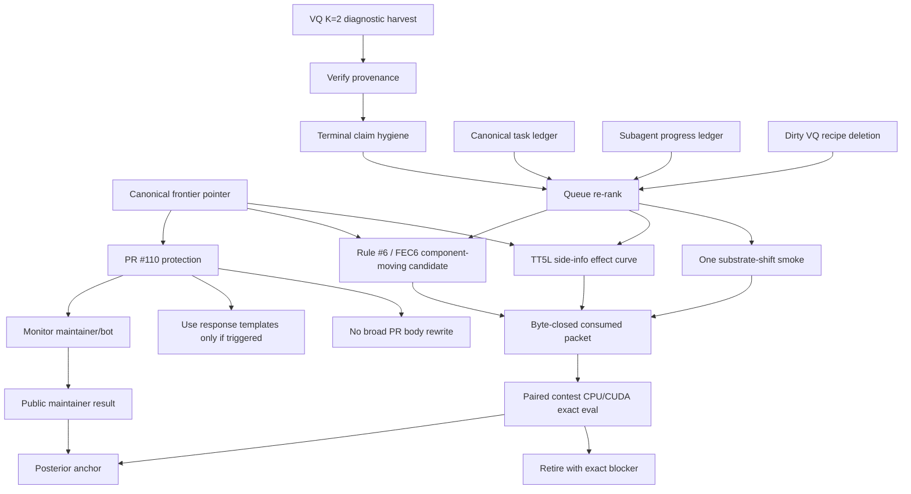

# New-Day Grand Council Symposium - Codex Execution Synthesis

This memo is a Codex-run grand-council-style execution review, integrating three
read-only scouts plus direct checks of the live PR, canonical frontier pointer,
task ledger, dispatch ledger, recent research memos, and GitHub surfaces.

It deliberately does not claim to be a new Claude-owned T3/T4 paradigm council.
Its job is to bind the current state into an execution plan.

## Summary Verdict

Verdict: `PROCEED_WITH_REVISIONS_AND_EXECUTION_FOCUS`.

The past few days produced real progress: PR #110 is live, the FEC6 submission
surface was corrected after the earlier V1 audit, D-3 compliance was cleared
internally, runtime equivalence and runtime byte-consumption proofs landed, V8
was moved from false-authority design to guarded local scaffold, and the VQ
diagnostic queue exposed real dispatch/provenance bugs instead of silently
promoting advisory evidence.

The system is still in a fragile state. The frontier is preserved, but the next
frontier movement probably will not come from same-runtime FEC6 byte polish.
The near-term job is to protect PR #110, harvest and terminalize active
diagnostics, prune stale queue residue, and choose one component-moving or
substrate-shift empirical path.

## Current Canonical State

### Frontier

Canonical pointer refreshed at `2026-05-20T11:57:11Z`.

| Axis | Current best | Archive | Bytes | Evidence |
|---|---:|---|---:|---|
| `contest_cpu` | `0.1920513168811056` | `6bae0201fb082457a02c69565531aba4c5942669c384fdc48e7d554f7b893fcf` | `178517` | `[contest-CPU]`, PR101/FEC6 |
| `contest_cuda` | `0.20533002902019143` | `9cb989cef519ed1771f6c9dc18c988ee93d01a2925da1913d63f9015d6247cf4` | `186876` | `[contest-CUDA]`, PR106 format0d |

`reports/latest.md` is still stale by header, even though its frontier facts
agree with `current_focus.md`, `next_experiments.md`, and the refreshed pointer.

### PR #110

Live GitHub check at this pass:

- PR: `https://github.com/commaai/comma_video_compression_challenge/pull/110`
- State: `open`, non-draft
- Head: `adpena/comma_video_compression_challenge:hnerv_fec6_fixed_huffman_k16`
- Head SHA: `ec6cc7f98c16b6ad2db8bc7cde65757bb7993004`
- Mergeability: `mergeable=true`, `mergeable_state=clean`
- Body length: `562` words by `gh pr view ... --json body | wc -w`

The earlier T3 layout blocker is no longer current. The live diff is now only:

- `submissions/hnerv_fec6_fixed_huffman_k16/inflate.py`
- `submissions/hnerv_fec6_fixed_huffman_k16/inflate.sh`
- `submissions/hnerv_fec6_fixed_huffman_k16/src/codec.py`
- `submissions/hnerv_fec6_fixed_huffman_k16/src/codec_sidecar.py`
- `submissions/hnerv_fec6_fixed_huffman_k16/src/frame_selector.py`
- `submissions/hnerv_fec6_fixed_huffman_k16/src/model.py`

The fork root README is restored to upstream-style root content; live root
`README.md` size is `21620` bytes. The submission directory is present under
`submissions/hnerv_fec6_fixed_huffman_k16/`.

PR body currently has the critical public facts in the right shape:

- Hosted archive URL points at GitHub Release
  `fec6-frontier-submission-20260520`.
- Archive SHA-256 is `6bae0201fb082457a02c69565531aba4c5942669c384fdc48e7d554f7b893fcf`.
- Archive size is `178517` bytes.
- ZIP member `x` is stated as stored uncompressed with `compression_type=0`.
- Source pin is public commit `b392343d758aba0d3595dd18609f9ca8a8af3e1b`.
- CPU and CUDA axes are labeled separately.
- PR101 Brotli boundary is correctly negated at ZIP and selector layers.

Remaining PR/public-surface warnings:

- Release notes still say "The companion PR will be opened" even though PR #110
  is already open. This is a small stale-tense issue, not a correctness blocker.
- Release notes reference the source-sync repo path under `experiments/results/...`.
  That is acceptable as a reproduction pointer but should not be expanded into
  private `.omx` citations.
- The actual upstream maintainer/bot response remains unobserved at this pass.
  Monitor PR #110 and use the landed response templates only if triggered.

### Worktree And Ledgers

`git status --short --branch`:

- Branch: `main...origin/main`
- Dirty item: deleted `.omx/operator_authorize_recipes/substrate_vq_vae_k_sweep_modal_t4_dispatch.yaml`

Treat that deletion as partner/operator WIP. Do not restore or commit over it
without checking intent. It matters because VQ diagnostics recently migrated
from the old T4 naming surface to A10G diagnostic wording.

Canonical task status:

- `79` latest tasks from `251` events.
- Latest statuses: `66 completed`, `9 blocked`, `3 pending`, `1 cancelled`.
- Validation is green: `{"rows": 251, "status": "valid"}`.

Subagent ledger:

- `522` latest subagents from `1871` events.
- Latest statuses: `476 complete`, `45 in_progress`, `1 blocked`.
- Many `in_progress` rows are stale historical residue; the live row to respect
  is `grand-council-t3-strategy-review-20260520` plus any currently active
  external Codex/Claude turns.

Active dispatch state:

- The latest VQ K=2 A10G diagnostic call `fc-01KS21XSVGM2KJ5ET0ET3YCCFN` was
  harvested at `2026-05-20T11:40:16Z` with `rc=0`, `score_claim=false`,
  `promotion_eligible=false`, and artifacts under
  `experiments/results/vq_vae_k_sweep_harvest_20260520`.
- The dispatch-claim ledger still needs exact terminal-row hygiene review for
  the newest active claim row if it was not closed by the in-context harvest.

## Council Findings

### Shannon

The frontier has split axes. The CPU best is FEC6/PR101 at `0.1920513`; the
CUDA best is PR106 format0d at `0.2053300`. Any plan that ranks or retires a
candidate by converting CPU to CUDA, or CUDA to CPU, is invalid.

### Dykstra

Feasibility is gated by custody before creativity. PR #110 is now in a cleaner
public posture, but the local system still carries stale in-progress rows,
blocked dispatch rows, and one dirty recipe deletion. Queue hygiene is not
cosmetic here; it prevents duplicate spend and false authority.

### Yousfi

PR #110 is now plausible as a maintainer-facing submission. The layout issue
that would have been an immediate reviewer-friction failure appears corrected
in the live head. Do not keep rewriting the PR body unless the maintainer asks
for it. Monitor, respond narrowly, and keep public claims shorter than internal
proof memos.

### Carmack

The highest-value action is not another meta-review. Harvest what is running,
close the ledger rows, and move one candidate from "interesting" to
"byte-closed and measured". Same-runtime FEC6 byte tricks are below the needed
rate threshold unless they move components.

### Selfcomp

The Selfcomp binding revision is satisfied in the current public surface:
ZIP member `x` is stored uncompressed, and Brotli is bounded to PR101's source
payload, not the ZIP layer and not the appended selector. Keep that exact
negation in any future edits.

### Assumption-Adversary

Three assumptions remain dangerous:

1. "PR submitted" equals "PR safe." False. It is clean now, but maintainer/bot
   evidence is still external and pending.
2. "FEC6 PacketIR closure" equals "score movement." False. The runtime
   consumption proof is local/compiler authority only.
3. "Many in-progress subagents" equals "many live tasks." False. The ledger has
   stale in-progress residue; current decisions should use active claims and
   latest terminal rows, not raw row counts.

## Last Few Days: Work Inventory

| Cluster | What landed | Current status |
|---|---|---|
| PR #110 FEC6 submission | Live PR, hosted release, source pin, corrected author attribution, public source pin, PR body compression, root layout corrected | Monitor and respond; no broad body rewrite |
| D-3 compliance | `scripts/pre_submission_compliance_check.py --contest-final --strict` reached rc=0 with `111/111` checks green in internal D-3 memo | Internal compliance proof; public maintainer still external authority |
| Runtime equivalence | Full-output SHA `d1afc583...` proves post-QQ-scrub runtime behavior byte-identical to auth-eval baseline | Closed for runtime-equivalence question |
| PacketIR/runtime consumption | Runtime consumed all `178417` member bytes; no-op detector passed; candidate queue rebuilt; `30 passed` | Local non-promotional compiler artifact; exact eval still gated |
| V8 Faiss | Premise fixes, scaffold, guard tests, disabled recipe, local fixture, readiness refusal | Continue local only; no dispatch/promotion |
| VQ K-sweep | Fixed recipe/trainer false authority; A10G diagnostic harvested after prior failures | Diagnostic only; terminal-row/provenance hygiene needed |
| PR95 local bridge | Source-faithful MPS/advisory smoke/training surface | Advisory only; control arm evidence, not promotion |
| Codec refactor | Byte-identity-preserving refactor completed and recorded | Do not reopen absent new runtime need |
| Catalog/preflight | Several false-authority gates and retrospectives landed | Useful, but risk of apparatus-heavy cycle remains |

## Outstanding Queue

### Immediate P0

1. PR #110 monitoring and response discipline.
   - Watch for maintainer bot or Yousfi comment.
   - Do not proactively expand the PR body.
   - If asked, answer with the landed templates and the compact public facts.

2. VQ diagnostic terminal hygiene.
   - Confirm `fc-01KS21XSVGM2KJ5ET0ET3YCCFN` has a matching terminal claim row
     against `lane_e7_vq_k_sweep_plus_e8_sgld_convergence_prep_20260518`.
   - Verify harvested provenance says `codebook_size=2`, `alpha_rate=1.0`,
     archive identity is `archive.zip`, and auth-eval is CPU advisory only.
   - Record a short findings memo if the in-context harvest did not already
     produce one.

3. Dirty recipe deletion decision.
   - Determine whether deleted
     `.omx/operator_authorize_recipes/substrate_vq_vae_k_sweep_modal_t4_dispatch.yaml`
     is an intentional migration to A10G diagnostic naming.
   - If intentional, land a memo or replacement recipe pointer so preflight and
     future operator-authorize calls do not chase a missing T4 surface.

4. Queue triage.
   - Convert stale `in_progress` subagent rows into terminal/no-op/backfilled
     records where appropriate.
   - Keep real active rows separate from historical residue.

5. Reports refresh.
   - Regenerate or update `reports/latest.md` so the stale header no longer
     undercuts the otherwise-current frontier facts.

### P1: Frontier Movement

1. Rule #6 A1/FEC6 component-moving bolt-ons.
   - Ballé hyperprior bolt-on.
   - PR101-style entropy stack bolt-on.
   - VQ-codebook bolt-on only after the K=2 diagnostic is fully interpreted.
   - Continue only when a byte-closed consumed packet exists.

2. Master-gradient operator response.
   - Land analytical score Lagrangian weights and uncertainty/early-stop
     helpers as real consumers, not just memos.
   - Tie operators to component deltas, not raw byte optimism.

3. TT5L side-info effect curve.
   - Run the doctor/source-manifest/claim sequence first.
   - Then run paired CPU/CUDA cells only after custody is clean.

4. Scorer-awareness probes.
   - Keep probe wave cheap and exact-labeled.
   - Use failures to prune dispatch, not to generate more speculative branches.

### P2: Substrate Shift

1. DreamerV3 RSSM / C6 reactivation.
   - The prior path-forward council favored hybrid PR protection plus one
     empirical substrate dispatch.
   - Do not launch until predecessor blockers and current active claims are
     clean.

2. V8 Faiss.
   - Keep research-only until real contest-video scorer training, Tier-C
     validation, byte-closed learned archive, exact CUDA auth eval, and paired
     axis custody exist.

3. Z6/Z7/Z8 recurrent/predictive cascade.
   - Use existing exact-eval failures and diagnostic scores to choose a smaller
     recurrence test before paid broad sweeps.

## Blocked And Pending Task Ledger

Blocked latest tasks:

| Task | Summary |
|---|---|
| `OP_SYN_1` | Master-gradient six-archive extension blocked on deterministic tensor-span projector |
| `PHASE_1_PROBES` | B1 Phase 1 AV1/codebook probes blocked by premise/custody issues |
| `BUILD_1` | Hinton-distilled SegNet surrogate Phase 1 blocked |
| `BUILD_2` | Z6-v2 Wave 2 4c re-fire blocked |
| `BUILD_3` | STC v2 ratify-or-defer blocked |
| `ITEM_4` | Catalog #204 follow-on A1 passthrough blocked by Catalog #313 predecessor refusal |
| `ITEM_5` | Z6 Wave 2 4c re-fire paid dispatch blocked |
| `ITEM_6` | STC v2 paid dispatch blocked |
| `DETERMINISTIC_PACKET_RUNTIME_AUTHORITY` | Deterministic packet compiler runtime authority hardening remains blocked |

Pending paid-dispatch rows:

| Task | Action |
|---|---|
| `ITEM_1` | C6.1 lane_17_imp LTH reactivation |
| `ITEM_2` | C6.3 PR106 #05/#06 reformulated paired smoke |
| `ITEM_3` | C6.5 mae_v + saug operational fix |

Recommendation: do not dispatch the pending paid rows as a batch. Re-rank them
after VQ terminal hygiene and after blocked predecessor rows are either cleared
or explicitly retired.

## Warnings

1. Same-runtime FEC6 byte polish is mostly exhausted.
   - PacketIR/profile work estimates roughly `16` realistic bytes.
   - Crossing strict `<0.192` from `0.1920513` needs roughly `78` charged bytes.
   - Next FEC6 work must move components or add a score-affecting procedural
     layer; byte-only recodes are low EV.

2. Advisory evidence is abundant.
   - MPS, diagnostic CPU, local fixture, and PacketIR parser evidence are useful
     but non-promotional.
   - Keep `score_claim=false`, `promotion_eligible=false`, and axis tags intact.

3. The task/subagent ledger is noisy.
   - Raw `in_progress=45` should not drive execution.
   - Use latest terminal state, active dispatch claims, and artifact evidence.

4. Apparatus churn risk is real.
   - The last few days had strong guard/preflight work, but the next frontier
     improvement needs an emitted archive, exact eval, or harvested diagnostic,
     not another broad council loop.

5. PR #110 can still fail socially even if technically clean.
   - Keep responses short, credited, and axis-labeled.
   - Do not surface internal gate names or `.omx` paths publicly.

## Short-Term Plan: Next 24 Hours

1. Protect PR #110.
   - Monitor bot/maintainer response.
   - Fix only provable public-text drift if it materially matters.
   - Keep response templates ready; no proactive essay.

2. Close VQ diagnostic state.
   - Verify harvest artifacts and append/confirm terminal claim.
   - Write one short diagnostic findings memo if missing.
   - Decide old T4 recipe deletion/migration explicitly.

3. Refresh public internal status.
   - Update `reports/latest.md` or write a refreshed report pointer so the
     stale header no longer conflicts with current canonical surfaces.

4. Queue pruning.
   - Backfill stale subagent rows.
   - Reclassify pending paid rows as `hold_pending_re_rank` unless their
     predecessor blockers are green.

5. Choose one frontier action.
   - Preferred: Rule #6 A1 component-moving byte-closed candidate.
   - Alternate: TT5L doctor/manifests/claims.
   - Do not spend on V8 or broad C6 until dispatch prerequisites are cleaner.

## Mid-Term Plan: 3-7 Days

1. FEC6/Rule #6 component movement.
   - Build one byte-closed packet candidate that changes Seg/Pose components,
     not only bytes.
   - Pair CPU/CUDA exact eval only after local consumed-packet custody passes.

2. Score Lagrangian operating layer.
   - Make the master-gradient weights a practical candidate filter.
   - Use uncertainty bounds to stop bad candidates before provider spend.

3. TT5L side-info effect curve.
   - Run a small paired grid to quantify whether side-info can buy enough score
     to justify L5-v2 architecture work.

4. VQ/V8/C6 substrate readiness.
   - VQ: interpret diagnostic and decide whether codebook route survives.
   - V8: remain local scaffold until trained archive exists.
   - C6/DreamerV3: one clean smoke only after current pending claims are clean.

5. Public/OSS hygiene.
   - Keep PR #110 lean.
   - Consolidate works-cited/public overview surfaces if companion docs remain
     part of the public story.

## Long-Term Plan: 2-6 Weeks

1. Move beyond the HNeRV local basin.
   - Treat PR101/FEC6 as preserved frontier and control arm.
   - Promote only candidates that beat it on matching contest axis evidence.

2. Build a byte-closed substrate staircase.
   - Predictive/recurrent representations.
   - Side-info effect curves.
   - Learned entropy/runtime grammars.
   - PacketIR/compiler paths that emit actual consumed bytes, not only proofs.

3. Collapse false authority structurally.
   - Every new provider/substrate lane must have recipe blockers, axis tags,
     exact-eval reachability, terminal claim hygiene, and public/private surface
     separation before promotion.

4. Keep public frontier watch live.
   - PR #110 maintainer results become canonical anchors once posted.
   - External PRs or comments that beat local frontier enter intake immediately.

5. Convert councils into actuators.
   - Any future grand-council verdict must name the exact next build, eval,
     archive, or blocker. If it does not change the next action, it is overhead.

## Staircase

```text
S0 - Preserve truth
  CPU frontier: FEC6/PR101 0.192051 [contest-CPU]
  CUDA frontier: PR106 format0d 0.205330 [contest-CUDA]
  Rule: never convert axes.

S1 - Protect public submission
  PR #110 open and clean
  Hosted archive + source pin + compact body
  Next: monitor bot/maintainer and respond narrowly.

S2 - Close active diagnostics
  VQ K=2 A10G diagnostic harvested
  Next: terminal claim/provenance memo; no score claim.

S3 - Clean queue authority
  Task ledger valid but noisy
  Next: stale in-progress backfill + pending paid dispatch re-rank.

S4 - Emit one component-moving candidate
  Rule #6 A1/FEC6 bolt-on or TT5L doctor path
  Gate: byte-closed consumed packet before exact eval.

S5 - Paired exact evidence
  CPU and CUDA evals on same archive/runtime
  Gate: archive SHA, bytes, runtime tree SHA, terminal claims, component deltas.

S6 - Substrate shift
  DreamerV3/C6, V8, Z6/Z7/Z8 only after guard/custody prerequisites
  Goal: real class movement, not same-basin recoding.

S7 - Public anchor or retire
  Maintainer PR result or internal exact eval becomes posterior anchor
  Bad lanes retire with precise blocker; good lanes become next champion packet.
```

## Dependency Graph



## Recommended Next Action

Do not convene another broad council immediately.

Run this order:

1. Verify/terminalize the harvested VQ K=2 diagnostic and record the result.
2. Resolve the deleted VQ T4 recipe surface as intentional migration or restore
   a safe placeholder pointer.
3. Refresh `reports/latest.md` or write the current-frontier report pointer.
4. Re-rank the three pending paid dispatch rows after ledger cleanup.
5. Start exactly one frontier-moving artifact path: Rule #6 A1 component-moving
   packet if a byte-closed consumed candidate is ready; otherwise TT5L doctor
   plus source manifests plus lane claim.

Until PR #110 receives maintainer/bot feedback, keep it under watch but do not
keep spending operator attention on public prose unless a live response is
needed.

<!-- # COUNCIL_TIER_FRONTMATTER_WAIVED:codex_execution_synthesis_memo_per_frontmatter_codex_boundary_explicit_disclaimer_NOT_claude_owned_paradigm_council_per_catalog_300_v2_contract_scope_appended_by_wave_1_forensic_fix_20260520_per_claude_md_historical_provenance_append_only_discipline -->
<!-- # COUNCIL_ROSTER_INCOMPLETE_OK:codex_execution_synthesis_memo_per_frontmatter_codex_boundary_explicit_disclaimer_NOT_claude_owned_paradigm_council_so_canonical_roster_validation_categorically_inapplicable_appended_by_wave_1_forensic_fix_20260520 -->

