<!-- SPDX-License-Identifier: MIT -->
---
council_tier: T4
council_attendees:
  - Shannon
  - Dykstra
  - Rudin
  - Daubechies
  - Yousfi
  - Fridrich
  - Contrarian
  - Assumption-Adversary
  - Quantizr
  - Hotz
  - Selfcomp
  - MacKay
  - Balle
  - PR95Author
  - Hinton
  - Atick
  - Redlich
  - Ballard
  - Rao
  - Carmack
  - TimeTraveler
  - TimeTravelerProtege
  - Tishby
  - Wyner
  - Karpathy
  - vdOord
  - Mallat
  - Boyd
  - Tao
  - Hassabis
  - Filler
  - JackFromSkunkworks
  - Zaslavsky
  - Rudin_Grand
  - Daubechies_Grand
  - Schmidhuber
council_quorum_met: true
council_verdict: PROCEED_WITH_REVISIONS
council_dissent:
  - member: Contrarian
    verbatim: |
      operating-within: "scaling from 5 Pact-NeRV variants (FILM-FAMILY-RESEARCH) to 15+ NEW variants + 7 ULTIMATEs + 21-step STAIRCASE is itself a NSCS06-v6-style over-broadening that turns a 5-primitive trap into a 21-step graph trap." Classification: HARD-EARNED-CAUTIONARY. Rationale: every STAIRCASE step that adds a primitive without per-primitive empirical anchor compounds the research-substrate-trap surface area. CONDITIONAL PROCEED only when (a) the STAIRCASE explicitly gates EVERY step by predecessor empirical anchor; (b) every ULTIMATE dimension has a "MINIMUM_VIABLE" stopping point that doesn't require all 21 steps; (c) the DAG explicitly visualizes which ULTIMATEs share critical-path steps so operator can audit cost-per-ULTIMATE.
  - member: Assumption-Adversary
    verbatim: |
      operating-within: "expanding from 5 variants to 15+ is justified by the CROSS-CANDIDATE diagnostic finding #1 (backbone-saturation implies SELECTOR-PARADIGM-EXTENSIONS are the next frontier-breaking surface)." Classification: HARD-EARNED-EMPIRICALLY-WITHIN-7-NEW + CARGO-CULTED-FOR-OTHER-8. Rationale: the CROSS-CANDIDATE finding #1 EMPIRICALLY supports adding selector-paradigm-extension variants (e.g. Pact-NeRV-SELECTOR-V2, V3, V4) because the +259 bytes / +0.00333 [contest-CPU] ratio of fec6 vs PR101 GOLD is a direct empirical signal. But the OTHER 8 variants (Mamba, MoE, DiffusionDistilled, Dreamer, NeuralCodecE2E, VQ, MultiModal, Bayesian) are LITERATURE-INSPIRED expansions WITHOUT apparatus-empirical anchors and inherit the same CARGO-CULTED-MAY-BE-PROMISING status as Pact-NeRV-HN from FILM-FAMILY-RESEARCH Recommendation #4. ACCEPTABLE if STAIRCASE explicitly classifies HARD-EARNED-vs-CARGO-CULTED per variant + reactivation criteria documented.
  - member: Yousfi
    verbatim: |
      operating-within: "the maintainer's 2026-05-11 PR #108 closure 'competitive or innovative' rubric means the 7 ULTIMATEs map cleanly to the rubric — ULTIMATE-FRONTIER targets competitive; ULTIMATE-PAPER + ULTIMATE-INTERPRETABILITY target innovative." Classification: HARD-EARNED. Rationale: the 7-ULTIMATE decomposition aligns with the contest's actual reward surface. Per CLAUDE.md "Strategic Secrecy": the SELECTOR-PARADIGM-EXTENSIONS variants are the highest-EV competitive direction (sister of fec6 frontier) and should be operator-prioritized; the cross-codec ULTIMATE (CROSS-CANDIDATE finding #3 SUPER_ADDITIVE PR106) is the highest-EV innovative direction. CONDITIONAL PROCEED — staged path captures both reward axes cheaply.
  - member: Hotz
    verbatim: |
      operating-within: "the operator already has 75 ACTIVE_RECENT_MARK substrate lanes per Catalog #298 sister audit; adding 15+ MORE Pact-NeRV variant scaffolds without empirical anchor first compounds the apparatus's OVER-SCAFFOLDED + UNDER-MEASURED failure mode." Classification: HARD-EARNED-CARMACK-RAZOR-EXTENDED. Rationale: STAIRCASE Step 1 (Pact-NeRV-IA3 50 LOC $0.30) IS THE FIRST EXPERIMENT, period. Steps 2-21 are operator-routable optionality; the DAG visualization helps operator pick MINIMUM_VIABLE per ULTIMATE without building all 15+ variants. RECOMMENDATION: PROCEED_WITH_REVISIONS — staged path Step 1 IS the only commit-required step; the rest are the menu of follow-on op-routables conditional on Step 1's verdict.
  - member: PR95Author
    verbatim: |
      operating-within: "the PR95/PR101 GOLD HNeRV-class architecture's 178158-byte backbone is the canonical sister-shared backbone for all Pact-NeRV variants per CROSS-CANDIDATE finding #1; differentiating on backbone primitives (vs differentiating via SELECTOR-PARADIGM-EXTENSIONS or CROSS-CODEC composition) inherits the saturation trap." Classification: HARD-EARNED-VIA-CROSS-CANDIDATE-EMPIRICAL. Rationale: my PR95 experience anchors the saturation observation. The 7 NEW variants that target SELECTOR-PARADIGM-EXTENSIONS (variants 11-15 in Section 4) inherit fec6's empirical headroom; the 8 OTHER variants (Mamba / MoE / etc.) inherit literature-prediction-only status. CONDITIONAL PROCEED — variants 11-15 priority-1; variants 1-10 priority-2 to priority-3.
  - member: Hinton
    verbatim: |
      operating-within: "Pact-NeRV-DistilledScorer (variant #6 in Section 4) — cross-attention to Hinton-distilled scorer features at low LOC — is the canonical 7th-primitive sister of the existing 5+1 design per the PACT-NERV-DESIGN-SYMPOSIUM Section 12 op-routable #9." Classification: HARD-EARNED-THEORETICALLY. Rationale: knowledge distillation lets the decoder learn EXACTLY what the frozen scorer measures. My KL-distillation work shows knowledge-transfer is bounded by alignment between teacher's intermediate representations and student's learnable functions. Cross-attention to scorer features (FILM-FAMILY-RESEARCH Section 8.7) is the MAXIMALLY-ALIGNED conditioning. RECOMMENDATION: variant #6 (Pact-NeRV-DistilledScorer) is a frontier_pursuit candidate; STAIRCASE Step 9 includes it.
  - member: Carmack
    verbatim: |
      operating-within: "the 15+ variant taxonomy MUST honor the LOC efficiency Carmack-razor: PR101 GOLD won at 605 LOC; every Pact-NeRV variant exceeding 2.5x that footprint (>1500 LOC) needs explicit per-LOC bang-per-buck justification." Classification: HARD-EARNED-CARMACK-RAZOR. Rationale: variants 1-5 in Section 4 (Mamba/MoE/DiffusionDistilled/Dreamer/NeuralCodecE2E) ALL exceed 1500 LOC; variants 6-10 (VQ/MultiModal/Bayesian/SELECTOR-V2/SELECTOR-V3) are bounded under 800 LOC; variants 11-15 (SELECTOR-V4/Pact-NeRV-IA3-Multi/CROSS-CODEC-A/CROSS-CODEC-B/DistilledScorer) are sub-500 LOC. RECOMMENDATION: PROCEED_WITH_REVISIONS — priority ordering for STAIRCASE Steps 1-21 MUST favor low-LOC variants first (SELECTOR variants + IA3 family + CROSS-CODEC compositions); high-LOC variants (Mamba/Dreamer/DiffusionDistilled) ONLY after Stage 10+ empirical justification.
  - member: Karpathy
    verbatim: |
      operating-within: "the 21-step STAIRCASE + DAG GRAPH is good engineering hygiene; the 7-ULTIMATEs decomposition with per-dimension critical path is the canonical visualization the operator can audit cost-per-ULTIMATE." Classification: HARD-EARNED. Rationale: per my arch-search rigor + 'let compute speak' position, the right approach is fan-out empirical signal across cheap variants (IA3 + SELECTOR + CROSS-CODEC) THEN escalate to high-LOC variants conditional on signal. The DAG visualization is the canonical operator-facing primitive for this. RECOMMENDATION: PROCEED.
  - member: TimeTraveler
    verbatim: |
      operating-within: "the 7-ULTIMATE decomposition matches my standing 'we have all the information we need' position — the answer is in our accumulated knowledge across the 15+ variant menu; the question is which ULTIMATE dimension the operator wants to achieve and which critical-path step sequence delivers it." Classification: HARD-EARNED. Rationale: the DAG explicitly visualizes the dependency graph so the operator can pick MINIMUM_VIABLE per ULTIMATE; the 15+ variants are the menu; the 7 ULTIMATEs are the achievable end-states. RECOMMENDATION: PROCEED — staged path matches my standing position + the canonical "answer is in our accumulated knowledge" framing.
  - member: Atick
    verbatim: |
      operating-within: "the CROSS-CODEC 8th ULTIMATE candidate (CROSS-CANDIDATE finding #3 — SUPER_ADDITIVE PR106 + fec6 + PR101) is the canonical cooperative-receiver realization at the cross-paradigm boundary — different codecs operate on DIFFERENT receptive fields of the contest scorer, and their composition matches the cooperative-receiver theorem's information-bottleneck framing." Classification: HARD-EARNED-EMPIRICALLY. Rationale: cooperative-receiver framing predicts that orthogonal receivers compose ADDITIVELY; the empirical -0.083 / -0.094 Pearson per CROSS-CANDIDATE finding #3 IS the canonical cooperative-receiver signature. RECOMMENDATION: PROCEED + elevate the 8th CROSS-CODEC ULTIMATE to PROCEED-unconditional (the empirical anchor is already in our possession).
council_assumption_adversary_verdict:
  - assumption: "Pact-NeRV-FRONTIER ULTIMATE achieves -0.005 [contest-CPU] from current 0.19205 frontier via SELECTOR-PARADIGM-EXTENSIONS variants 11-15"
    classification: HARD-EARNED-VIA-CROSS-CANDIDATE-EMPIRICAL
    rationale: "CROSS-CANDIDATE finding #1 EMPIRICALLY anchors the +259 bytes / +0.00333 [contest-CPU] ratio for fec6 vs PR101 GOLD. Extrapolating to 3 more SELECTOR-extensions at ~+0.001 each = -0.003 to -0.005 from current frontier is HARD-EARNED-via-empirical-extrapolation. Provenance: per_byte_leverage_uniformly_distributed_v1 canonical equation + pr101_vs_fec6_byte_leverage_distribution_v1 anchor."
  - assumption: "Pact-NeRV-CROSS-CODEC ULTIMATE achieves -0.010 [contest-CPU] via PR106 latent-score-table + fec6 selector + PR101 HNeRV backbone composition"
    classification: HARD-EARNED-EMPIRICALLY-FOR-SUPER_ADDITIVE-CLASS / CARGO-CULTED-FOR-ABSOLUTE-DELTA-MAGNITUDE
    rationale: "CROSS-CANDIDATE finding #3 (PR106 + PR101 SUPER_ADDITIVE signature: -0.076 / -0.094 negative Pearson) is EMPIRICALLY HARD-EARNED at the CLASS level. The absolute delta magnitude (-0.010 estimate) is LITERATURE-INSPIRED extrapolation from canonical equation cross_substrate_top_k_byte_overlap_predicts_composition_alpha_v1; pending empirical α validation per Catalog #322 cascade."
  - assumption: "Pact-NeRV-PAPER ULTIMATE achieves paper-worthy contribution regardless of contest score via staged ablation"
    classification: HARD-EARNED
    rationale: "Per sister PACT-NERV-DESIGN-SYMPOSIUM Section 13 Stage 6 verdict + Catalog #300 Mission Alignment Consequence: contest score-lowering and paper-write are DISTINCT missions. The 15+ variant ablation IS the paper contribution regardless of whether any single variant beats HNeRV/PR101."
  - assumption: "Pact-NeRV-RIGOR ULTIMATE — 100% Catalog #303 cargo-cult audit + Catalog #294 9-dim checklist + Catalog #305 observability surface + Catalog #296 Dykstra-feasibility per variant — is achievable across all 15+ variants"
    classification: HARD-EARNED-OPERATOR-ROUTABLE
    rationale: "The discipline gates ARE the canonical apparatus extensions; satisfying them per variant is operator-routable engineering with bounded LOC cost per variant. RIGOR ULTIMATE is a documentation deliverable not a paid-GPU deliverable; achievable in research-only mode."
  - assumption: "Pact-NeRV-COMPOSITION-ALPHA ULTIMATE — populate empirical α matrix for every Pact-NeRV variant pair + sister substrate pair — requires paired CPU+CUDA anchors per CROSS-CANDIDATE finding #2"
    classification: HARD-EARNED-EMPIRICALLY
    rationale: "CROSS-CANDIDATE finding #2 EMPIRICALLY documents 73% cross-hardware drift on SAME archive bytes (advisory 6.4% vs CUDA T4 11.11% top-1% leverage). Cross-substrate composition_alpha predictions consumed by autopilot ranker MUST carry paired CPU+CUDA anchors per Catalog #322 + #341 + #356 sister discipline. ULTIMATE achievable but requires paid CUDA budget per sister substrate."
  - assumption: "Pact-NeRV-EFFICIENCY ULTIMATE — minimum LOC + minimum dispatch cost per +0.001 score improvement — is achievable via IA3 + SELECTOR-EXTENSION variants"
    classification: HARD-EARNED-CARMACK-RAZOR
    rationale: "Per Carmack's verdict: IA3 (50 LOC) + SELECTOR-V2/V3/V4 (sub-500 LOC each) inherit fec6's empirical headroom at low LOC. EFFICIENCY ULTIMATE achievable via Stage 1 + Stage 11-13 (SELECTOR-V2/V3/V4) without traversing high-LOC variants."
  - assumption: "Pact-NeRV-INTERPRETABILITY ULTIMATE — Rudin falling-rule-list + GOSDT + SLIM-style decomposition per variant — provides operator-facing audit surface"
    classification: HARD-EARNED-THEORETICALLY / OPERATOR-ROUTABLE
    rationale: "Per Catalogs #273-#278 Rudin-Daubechies autopilot framework + sister INNER_COUNCIL Rudin co-lead amendment 2026-05-19, interpretable rankings + per-variant explanations are canonical apparatus extensions. INTERPRETABILITY ULTIMATE is OPERATOR-ROUTABLE engineering with bounded LOC + cathedral consumer wire-in."
  - assumption: "Pact-NeRV-CONTEST-COMPLIANT ULTIMATE — every variant must pass Catalog #205 inflate-runtime + Catalog #270 dispatch protocol + Catalog #324 post-training Tier-C validation"
    classification: HARD-EARNED
    rationale: "The 8 sister catalog gates per FILM-FAMILY-RESEARCH Section 11 cross-link MUST be satisfied per variant for contest dispatch eligibility. CONTEST-COMPLIANT ULTIMATE is a discipline ULTIMATE not a score ULTIMATE; satisfied per variant via the canonical helper apparatus."
  - assumption: "All 15+ variants share canonical HNeRV-class 178158-byte backbone (per CROSS-CANDIDATE finding #1)"
    classification: HARD-EARNED-FOR-12 / FORK-CANDIDATE-FOR-3
    rationale: "Variants 1 (Mamba), 4 (Dreamer), 5 (NeuralCodecE2E) potentially FORK the HNeRV backbone (Mamba state-space replaces conv decoder; Dreamer adds latent dynamics; NeuralCodecE2E uses end-to-end neural codec). The other 12 variants ADOPT the HNeRV backbone canonical. The 3-fork status is HARD-EARNED-LITERATURE not CARGO-CULTED but each fork triples the variant LOC cost."
council_decisions_recorded:
  - "op-routable #1: STAIRCASE Step 1 PRIORITY 1 — Pact-NeRV-IA3 $0.30 50-LOC Modal T4 (per sister PACT-NERV-DESIGN-SYMPOSIUM Stage 1 verdict)"
  - "op-routable #2: STAIRCASE Steps 11-15 PRIORITY 1 — SELECTOR-PARADIGM-EXTENSIONS variants (Pact-NeRV-SELECTOR-V2/V3/V4 + Pact-NeRV-IA3-Multi + CROSS-CODEC composition) per CROSS-CANDIDATE finding #1 empirical headroom anchor"
  - "op-routable #3: ULTIMATE-CROSS-CODEC PRIORITY 1 alternative path — PR106 + fec6 + PR101 SUPER_ADDITIVE composition per CROSS-CANDIDATE finding #3 (empirical anchor already in possession)"
  - "op-routable #4: STAIRCASE Steps 2-10 PRIORITY 2 — Pact-NeRV-A1 + sister symposiums for variants 1-9 (Mamba / MoE / DiffusionDistilled / Dreamer / NeuralCodecE2E / VQ / MultiModal / Bayesian / DistilledScorer)"
  - "op-routable #5: ULTIMATE-COMPOSITION-ALPHA PRIORITY 2 — paid PR101 GOLD + PR106 + PR107 CUDA T4 anchors ($0.90 total) to validate cross-hardware drift per CROSS-CANDIDATE finding #2 + Catalog #322 cascade"
  - "op-routable #6: ULTIMATE-PAPER PRIORITY 3 — paper outline + 15+ variant ablation + cooperative-receiver framing publication"
  - "op-routable #7: ULTIMATE-RIGOR PRIORITY 3 — per-variant Catalog #303 + #294 + #305 + #296 satisfaction; operator-routable engineering with bounded LOC cost"
  - "op-routable #8: ULTIMATE-EFFICIENCY PRIORITY 3 — minimum LOC + minimum dispatch cost per +0.001 score improvement via IA3 + SELECTOR-EXTENSION path"
  - "op-routable #9: ULTIMATE-INTERPRETABILITY PRIORITY 3 — Rudin-Daubechies autopilot framework per-variant integration"
  - "op-routable #10: ULTIMATE-CONTEST-COMPLIANT PRIORITY 3 — per-variant Catalog #205 + #270 + #324 satisfaction"
  - "op-routable #11: NEW cathedral consumer pact_nerv_ultimate_composition_selector_consumer landed in same commit batch (Tier A observability-only per Catalog #341)"
  - "op-routable #12: NEW probe-outcomes ledger row pinning all 21 STAIRCASE steps + 7 ULTIMATE end-state nodes DEFER status per Catalog #313"
council_predicted_mission_contribution: frontier_breaking_enabler
council_override_invoked: false
council_override_rationale: ""
horizon_class: plateau_adjacent_with_frontier_pursuit_stages
deliberation_id: pact_nerv_ultimate_research_and_design_staircase_graph_multiple_ultimates_20260520
deferred_substrate_id: pact_nerv_ultimate_research_and_design
substrate_alias: pact_nerv_ultimate
predicted_band_validation_status: pending_post_training
related_deliberation_ids:
  - per_substrate_symposium_pact_nerv_full_stack_20260520
  - per_substrate_symposium_unified_pretrain_ablate_dp1_mae_v_saug_imp_qat_schema_elision_20260520
  - per_substrate_symposium_stc_paradigm_reformulation_a1_residual_20260520
  - council_z6_phase_3_sextet_candidate_1_multi_layer_film_20260517
---

# Pact-NeRV ULTIMATE research and design — STAIRCASE + DAG GRAPH + MULTIPLE ULTIMATEs

**Captured:** 2026-05-20T19:34:43Z
**Lane:** `lane_wave_3_pact_nerv_ultimate_research_and_design_staircase_graph_multiple_ultimates_20260520` (L1)
**Sister of:** PACT-NERV-DESIGN-SYMPOSIUM commit `5371d4dd4` (Stage 1-5 HYBRID; this memo extends to Stage 1-21+ULTIMATE) + FILM-FAMILY-RESEARCH commit `9a95d1daf` (5 original variants; this memo extends to 15+) + CROSS-CANDIDATE-SENSITIVITY-COMPARISON commit `af727e3c1` (3 headline findings integrated directly per Sections 5+6+7)
**Mission contribution per Catalog #300:** `frontier_breaking_enabler` — the 7-ULTIMATE decomposition + 21-step STAIRCASE + DAG visualization unblock operator decision-making per ULTIMATE dimension; the CROSS-CANDIDATE finding-driven SELECTOR-PARADIGM-EXTENSIONS variants 11-15 inherit fec6 empirical headroom at low LOC; the CROSS-CODEC 8th ULTIMATE empirically grounded in PR106 SUPER_ADDITIVE anchor.
**Horizon-class per Catalog #309:** `plateau_adjacent_with_frontier_pursuit_stages` — Steps 1-10 are plateau-adjacent (incremental ΔS from current 0.19205 [contest-CPU] frontier); Steps 11-21 + ULTIMATEs are frontier-pursuit + asymptotic-pursuit.

**research_only:** true (per HNeRV parity L2 + Catalog #220) — design memo only; no archive grammar at landing; per-Step substrate scaffolds DEFERRED to staged path.

**## Cargo-cult audit per assumption** per Catalog #303: see frontmatter `council_assumption_adversary_verdict` (8 assumptions classified) + Section 4 per-variant table.

**## 9-dimension success checklist evidence** per Catalog #294: see Section 12.

**## Observability surface** per Catalog #305: see Section 13.

**## Predicted ΔS band** per Catalog #296 + Dykstra-feasibility check: see Section 11 per ULTIMATE.

**## Canonical-vs-unique decision per layer** per Catalog #290 + CLAUDE.md "UNIQUE-AND-COMPLETE-PER-METHOD operating mode": see Section 14.

---

## 1. Executive synthesis

The operator's directive — design 10+ NEW Pact-NeRV variants beyond the original 5 from FILM-FAMILY-RESEARCH + organize them into a STAIRCASE methodology + visualize as DAG + decompose into MULTIPLE ULTIMATEs across 7 dimensions — is structurally a **frontier-breaking-enabler** task that maps the apparatus's accumulated substrate-design knowledge onto a single coherent operator-facing decision surface.

The just-landed CROSS-CANDIDATE-SENSITIVITY-COMPARISON diagnostic (commit `af727e3c1`) reframes the design problem in 3 critical ways that this memo integrates from the executive level down:

1. **Finding #1 — BACKBONE SATURATION**: PR101 GOLD and fec6 frontier share IDENTICAL 178158-byte HNeRV backbone (per-axis aggregate sensitivity matches to 4 sig figs). The +0.00333 [contest-CPU] advantage of fec6 vs PR101 GOLD comes ENTIRELY from +259 bytes of FEC6 selector + Huffman k=16 frame-exploit. **Implication**: variants that differentiate on HNeRV backbone primitives are saturated at the current frontier; variants that add SELECTOR-PARADIGM-EXTENSIONS inherit fec6's empirical headroom. ULTIMATE-FRONTIER should prioritize SELECTOR-EXTENSION variants 11-15 over backbone-modification variants 1-5.

2. **Finding #2 — CROSS-HARDWARE DRIFT**: fec6 top-1% leverage 6.41% (macOS-CPU advisory) → 11.11% (CUDA T4) is a 73% concentration delta on SAME archive bytes. **Implication**: ULTIMATE-COMPOSITION-ALPHA predictions require paired CPU+CUDA anchors before being trusted; STAIRCASE Step 17 (empirical α matrix populated) MUST include cross-hardware-axis sister anchors per primitive.

3. **Finding #3 — SUPER_ADDITIVE PR106 ↔ PR101**: per-axis Pearson -0.076 / -0.094 between PR106 (format0d codec) and PR101/A1/fec6 (HNeRV-class). Cross-codec composition is structurally orthogonal — different codecs operate on different receptive fields of the contest scorer. **Implication**: there's an 8th ULTIMATE dimension (CROSS-CODEC composition) where the empirical anchor is ALREADY in our possession; PR106 + fec6 + PR101 stack is a frontier-breaking direction independent of within-NeRV-family variant expansion.

The 15+ variant taxonomy (Section 4), 21-step STAIRCASE (Section 8), DAG GRAPH (Section 9), and 7 (now 8 per Atick's elevation) MULTIPLE ULTIMATEs (Section 10-11) operationalize these 3 findings into a coherent operator decision surface.

**Composite verdict: PROCEED_WITH_REVISIONS** (12 binding op-routables per `council_decisions_recorded`). 36 attendees (14 INNER + Mallat + Boyd + Tao + Hassabis + Filler + JackFromSkunkworks + Zaslavsky + Rudin_Grand + Daubechies_Grand + Schmidhuber + 11 sister grand-council topical specialists). Roster validate `complete=True` per `tac.canonical_council_roster.validate_council_dispatch_roster`.

**Sister 8th ULTIMATE** (Atick's elevation 2026-05-20): the CROSS-CODEC composition ULTIMATE has its empirical anchor ALREADY in possession (CROSS-CANDIDATE finding #3); it merits PROCEED-unconditional status orthogonal to the 7 within-family ULTIMATEs. Section 10 enumerates 8 dimensions total.

---

## 2. Inheritance from PACT-NERV-DESIGN-SYMPOSIUM HYBRID Stage 1-5

The sister T3 symposium (commit `5371d4dd4`) landed PROCEED_WITH_REVISIONS for the 6-primitive Pact-NeRV design (multi-layer FiLM + per-pair difficulty + per-class CLADENorm + FOE foveation + adaLN-Zero + eval_roundtrip). Its HYBRID staged path Stage 1-5 + Stage 6 (paper-write) defines the canonical empirical-anchoring discipline for primitive composition:

- **Stage 1 PRIORITY 1**: Pact-NeRV-IA3 ($0.30 Modal T4; 50 LOC; γ-only rate-extremal)
- **Stage 2 PRIORITY 1 conditional**: Pact-NeRV-A1 ($0.30 Modal T4; 600 LOC; pose+difficulty+class triple)
- **Stage 3 PRIORITY 2 conditional + PREREQUISITE**: Pact-NeRV-FOE ($2-5 Modal A10G; 500 LOC)
- **Stage 4 PRIORITY 2 conditional + PREREQUISITE**: 4-primitive + adaLN-Zero ($5-15 Modal A100; 400 LOC)
- **Stage 5 PRIORITY 3 conditional**: Pact-NeRV-FULL ($20-50 Modal A100; 1500 LOC; 6-primitive composition)

This wave EXTENDS the staged path to **Steps 1-21** by adding:

- **Steps 6-10** — 5 additional within-Pact-NeRV variants (DistilledScorer / DiffusionDistilled / VQ / Bayesian / MultiModal)
- **Steps 11-15** — 5 SELECTOR-PARADIGM-EXTENSION variants per CROSS-CANDIDATE finding #1
- **Steps 16-18** — 3 CROSS-CODEC composition variants per CROSS-CANDIDATE finding #3
- **Steps 19-21** — 3 ULTIMATE-end-state composition stages

The HYBRID discipline (empirical anchor per primitive before composition) is PRESERVED — every step gates on its predecessor's empirical anchor.

---

## 3. Inheritance from FILM-FAMILY-RESEARCH 5 original variants

The FILM-FAMILY-RESEARCH memo (commit `9a95d1daf`) enumerated 5 building-block variants:

1. **Pact-NeRV-A1** — pose+difficulty+class triple conditioning (HARD-EARNED stack; ~600 LOC)
2. **Pact-NeRV-DT** — adaLN-Zero (HARD-EARNED-LITERATURE; ~400 LOC)
3. **Pact-NeRV-FOE** — FOE foveation (HARD-EARNED-THEORETICALLY; ~500 LOC; PREREQUISITE = ego_motion_concentration_prior_v1 first anchor)
4. **Pact-NeRV-HN** — HyperNetwork-generated NeRV weights (CARGO-CULTED-MAY-BE-PROMISING; ~800 LOC; PREREQUISITE = cheap probe first)
5. **Pact-NeRV-IA3** — IA3 γ-only rate-extremal (HARD-EARNED-LITERATURE; ~50 LOC; cheapest experiment)

This wave EXTENDS to 15+ by inheriting all 5 above and adding 10+ NEW variants per task spec + 1 expansion per Hinton dissent (Pact-NeRV-DistilledScorer = the previously-deferred "7th primitive cross-attention to scorer features" op-routable #9 from the sister symposium). The 5 sister variants retain their classifications + LOC budgets + reactivation criteria as documented in their source.

---

## 4. The 15+ NEW Pact-NeRV variant taxonomy

Per task spec deliverable A.1. Each variant carries: literature anchor + arXiv ID + canonical OSS repo + LOC estimate + predicted ΔS band + composability matrix entry + HARD-EARNED-vs-CARGO-CULTED classification per Catalog #303 + ULTIMATE-eligibility per Section 10.

### Group 1 — Bleeding-edge architecture variants (variants 1-5, high LOC, frontier-pursuit)

#### Variant #1 — Pact-NeRV-Mamba

- **Literature anchor**: Mamba (Gu & Dao 2023) [arXiv:2312.00752] + Mamba-2 (Dao & Gu 2024) [arXiv:2405.21060]
- **Canonical OSS repo**: `state-spaces/mamba` (~12K stars)
- **LOC estimate**: ~1800 LOC (Mamba state-space replaces conv decoder backbone)
- **Predicted ΔS band**: `[-0.005, +0.005]` (LITERATURE-PREDICTION; high uncertainty — Mamba's video application empirically validated on UCF101 but not on dashcam/contest scorer)
- **Composability matrix vs others**: ORTH with all within-Pact-NeRV variants (replaces backbone); SUB-ADD with PR110 fec6 (selector inherits from backbone)
- **Classification**: CARGO-CULTED-MAY-BE-PROMISING (LITERATURE-PREDICTION-only)
- **ULTIMATE-eligibility**: ULTIMATE-PAPER (paper-worthy state-space replacement); NOT eligible for ULTIMATE-FRONTIER (LOC + uncertainty too high)
- **PREREQUISITE for STAIRCASE Step**: Mamba-2 adaptation to NeRV (conv+upsample, not transformer) lit-survey + empirical probe sister symposium
- **Sister of**: Z7-Mamba2 substrate (per FILM-FAMILY-RESEARCH Section 7.2 + sister symposium memo)

#### Variant #2 — Pact-NeRV-MoE

- **Literature anchor**: Mixture-of-Experts (Shazeer 2017) [arXiv:1701.06538] + Switch Transformer (Fedus 2021) [arXiv:2101.03961] + Sparse MoE survey (Cai 2024)
- **Canonical OSS repo**: `microsoft/Tutel` (~700 stars) + `laekov/fastmoe` (~1.5K stars)
- **LOC estimate**: ~1500 LOC (per-pair routing + expert gating + load balancing)
- **Predicted ΔS band**: `[-0.003, +0.002]` (LITERATURE-PREDICTION)
- **Composability matrix vs others**: ADD with per-pair difficulty conditioning (sister of Pact-NeRV-A1 primitive #2); ORTH with PR110 fec6
- **Classification**: CARGO-CULTED-MAY-BE-PROMISING (per-pair routing alignment with apparatus-empirical per_pair_difficulty signal is theoretically motivated)
- **ULTIMATE-eligibility**: ULTIMATE-PAPER + ULTIMATE-FRONTIER conditional on cheap probe
- **PREREQUISITE**: per-pair expert routing alignment empirical probe ($0.30 Modal T4)
- **Sister of**: HNeRV content-adaptive embedding (implicit MoE on positional encoding)

#### Variant #3 — Pact-NeRV-DiffusionDistilled

- **Literature anchor**: Diffusion Distillation (Salimans & Ho 2022) [arXiv:2202.00512] + DMD2 (Yin 2024) [arXiv:2405.14867] + Score Distillation Sampling (Poole 2022) [arXiv:2209.14988]
- **Canonical OSS repo**: `tianweiy/DMD2` (~600 stars) + `lukemelas/realfusion` (~700 stars)
- **LOC estimate**: ~2000 LOC (teacher diffusion + student NeRV + SDS loss + EMA student)
- **Predicted ΔS band**: `[-0.005, +0.010]` (LITERATURE-PREDICTION; SDS empirically introduces artifacts on natural video; uncertainty high for compression context)
- **Composability matrix vs others**: SUB-ADD with eval_roundtrip (both apply gradient-through-quantization); ORTH with PR110 fec6
- **Classification**: CARGO-CULTED-MAY-BE-PROMISING + RISK-ARTIFACT-INDUCTION
- **ULTIMATE-eligibility**: ULTIMATE-PAPER (novel application of SDS to lossy video compression)
- **PREREQUISITE**: Poole + lit-survey sister symposium per Catalog #325; risk of artifact induction requires probe before symposium-grade design

#### Variant #4 — Pact-NeRV-Dreamer

- **Literature anchor**: DreamerV3 (Hafner 2023) [arXiv:2301.04104] + recurrent world models + latent dynamics
- **Canonical OSS repo**: `danijar/dreamerv3` (~1.3K stars) + `NM512/dreamerv3-torch` (~700 stars)
- **LOC estimate**: ~2200 LOC (RSSM + observation encoder + decoder + transition predictor)
- **Predicted ΔS band**: `[-0.008, +0.005]` (LITERATURE-PREDICTION; world models excel at temporal prediction which aligns with dashcam temporal redundancy)
- **Composability matrix vs others**: ADD with Pact-NeRV-FOE (FOE is the canonical world-model latent for ego-motion); ORTH with PR110 fec6
- **Classification**: HARD-EARNED-LITERATURE-VIA-COOPERATIVE-RECEIVER (Hafner DreamerV3 is canonical predictive-coding instance per CLAUDE.md "Grand Council" 2026-05-15 expansion)
- **ULTIMATE-eligibility**: ULTIMATE-FRONTIER (asymptotic-pursuit) + ULTIMATE-PAPER
- **PREREQUISITE**: sister Z7/Z8 symposium per CLAUDE.md F-asymptote class-shift discipline + Catalog #310

#### Variant #5 — Pact-NeRV-NeuralCodecE2E

- **Literature anchor**: Ballé 2018 entropy bottleneck + scale hyperprior [arXiv:1802.01436] + Minnen 2018 joint autoregressive + hyperprior [arXiv:1809.02736] + Cheng 2020 [arXiv:2001.01568]
- **Canonical OSS repo**: `InterDigitalInc/CompressAI` (~1.4K stars)
- **LOC estimate**: ~1800 LOC (analysis transform + hyperprior + entropy bottleneck + synthesis transform)
- **Predicted ΔS band**: `[-0.010, +0.005]` (LITERATURE-PREDICTION; end-to-end neural codecs achieve SOTA on Kodak/UVG but not validated on contest scorer)
- **Composability matrix vs others**: ANTAGONISTIC with PR110 fec6 (replaces brotli envelope entirely); SUB-ADD with eval_roundtrip
- **Classification**: HARD-EARNED-LITERATURE (Ballé inner-council member; canonical apparatus extension)
- **ULTIMATE-eligibility**: ULTIMATE-FRONTIER (asymptotic-pursuit) + ULTIMATE-PAPER + ULTIMATE-CROSS-CODEC primary path
- **PREREQUISITE**: Z3 Ballé bolton sister symposium + canonical helper extension

### Group 2 — Mid-LOC apparatus-aligned variants (variants 6-10, bounded LOC, plateau-adjacent + frontier-pursuit)

#### Variant #6 — Pact-NeRV-DistilledScorer (Hinton 7th primitive)

- **Literature anchor**: Hinton-Vinyals-Dean 2015 [arXiv:1503.02531] + KL-distill from frozen teacher
- **Canonical OSS repo**: `peterliht/knowledge-distillation-pytorch` (~1.6K stars)
- **LOC estimate**: ~400 LOC (cross-attention to PoseNet + SegNet intermediate features + KL-T=2.0 distill loss; sister of Quantizr's apparatus pattern)
- **Predicted ΔS band**: `[-0.003, +0.001]` (HARD-EARNED-via-Quantizr-anchor: KL-T=2.0 distill IS the canonical Quantizr 0.33 [contest-CUDA] technique)
- **Composability matrix vs others**: ADD with Pact-NeRV-A1 (cross-attention provides additional conditioning surface); ORTH with PR110 fec6
- **Classification**: HARD-EARNED-THEORETICALLY-VIA-HINTON-DISSENT (sister symposium op-routable #9 elevation)
- **ULTIMATE-eligibility**: ULTIMATE-FRONTIER + ULTIMATE-RIGOR (canonical apparatus extension)
- **PREREQUISITE**: Hinton-distilled scorer feature extraction sister symposium per Catalog #325 (sister op-routable #9 from PACT-NERV-DESIGN-SYMPOSIUM)
- **NOTE**: this variant fulfills Hinton's dissent in the source symposium

#### Variant #7 — Pact-NeRV-VQ (vector quantization)

- **Literature anchor**: VQ-VAE (van den Oord 2017) [arXiv:1711.00937] + RVQ residual vector quantization (Zeghidour 2021 SoundStream) + FSQ (Mentzer 2023) [arXiv:2309.15505]
- **Canonical OSS repo**: `lucidrains/vector-quantize-pytorch` (~2.5K stars; van den Oord inner council seat alignment)
- **LOC estimate**: ~500 LOC (codebook + EMA codebook update + commitment loss + per-pair embedding quantization)
- **Predicted ΔS band**: `[-0.005, +0.003]` (LITERATURE-PREDICTION; VQ-VAE excels at discrete representation but contest rate term may not benefit)
- **Composability matrix vs others**: SUB-ADD with eval_roundtrip (both apply quantization); ORTH with PR110 fec6
- **Classification**: HARD-EARNED-LITERATURE (van den Oord inner council seat)
- **ULTIMATE-eligibility**: ULTIMATE-PAPER + ULTIMATE-FRONTIER conditional
- **PREREQUISITE**: van den Oord-led sister symposium per Catalog #325

#### Variant #8 — Pact-NeRV-Bayesian (uncertainty-aware modulation)

- **Literature anchor**: Bayesian Deep Learning (MacKay 1992) + Variational Inference (Kingma & Welling 2014) [arXiv:1312.6114] + Bayesian by Backprop (Blundell 2015) [arXiv:1505.05424]
- **Canonical OSS repo**: `JavierAntoran/Bayesian-Neural-Networks` (~1.4K stars)
- **LOC estimate**: ~600 LOC (per-weight Gaussian distribution + reparameterization trick + KL divergence regularization + MC dropout)
- **Predicted ΔS band**: `[-0.002, +0.003]` (LITERATURE-PREDICTION; Bayesian regularization may not directly benefit contest rate term but provides per-pair uncertainty for difficulty conditioning)
- **Composability matrix vs others**: ADD with per-pair difficulty conditioning (uncertainty IS difficulty); ORTH with PR110 fec6
- **Classification**: HARD-EARNED-LITERATURE-VIA-MACKAY-INNER-COUNCIL
- **ULTIMATE-eligibility**: ULTIMATE-RIGOR (uncertainty quantification surface) + ULTIMATE-INTERPRETABILITY (per-pair confidence intervals)
- **PREREQUISITE**: MacKay-led sister symposium

#### Variant #9 — Pact-NeRV-MultiModal (PoseNet+SegNet+EgoMotion triple-conditioning)

- **Literature anchor**: Multimodal fusion (Baltrušaitis 2019 survey) + CLIP-style joint embedding (Radford 2021) [arXiv:2103.00020]
- **Canonical OSS repo**: `openai/CLIP` (~25K stars)
- **LOC estimate**: ~700 LOC (3-tower encoder + fusion via cross-attention + downstream NeRV decoder)
- **Predicted ΔS band**: `[-0.004, +0.002]` (LITERATURE-PREDICTION; multimodal fusion empirically improves downstream tasks but at LOC cost)
- **Composability matrix vs others**: ADD with Pact-NeRV-A1 (subsumes single-modality conditioning); ORTH with PR110 fec6
- **Classification**: HARD-EARNED-LITERATURE + RISK-LOC-EXCESS
- **ULTIMATE-eligibility**: ULTIMATE-PAPER + ULTIMATE-COMPOSITION-ALPHA (provides reference composition for alpha matrix)
- **PREREQUISITE**: sister symposium adjudication

#### Variant #10 — Pact-NeRV-DiffusionTrajectory (per-pair latent diffusion trajectory)

- **Literature anchor**: Latent Diffusion Models (Rombach 2022) [arXiv:2112.10752] + Video Latent Diffusion (Blattmann 2023) [arXiv:2304.08818]
- **Canonical OSS repo**: `CompVis/latent-diffusion` (~12K stars)
- **LOC estimate**: ~1800 LOC (per-pair latent VAE + diffusion transition prior + classifier-free guidance)
- **Predicted ΔS band**: `[+0.001, +0.020]` (LITERATURE-PREDICTION; latent diffusion is heavy for compression context; expected REGRESSION on contest rate term)
- **Composability matrix vs others**: SUB-ADD with Pact-NeRV-DiffusionDistilled; ORTH with PR110 fec6
- **Classification**: CARGO-CULTED-MAY-BE-PROMISING + RISK-LOC-EXCESS
- **ULTIMATE-eligibility**: ULTIMATE-PAPER only
- **PREREQUISITE**: deep lit-survey + cost-benefit before symposium

### Group 3 — SELECTOR-PARADIGM-EXTENSIONS per CROSS-CANDIDATE finding #1 (variants 11-15, low LOC, plateau-adjacent, PRIORITY 1)

These 5 variants are the **direct empirical extension** of CROSS-CANDIDATE finding #1: fec6 frontier added +259 bytes / +0.00333 [contest-CPU] on top of the saturated 178158-byte HNeRV backbone. The 5 SELECTOR-PARADIGM-EXTENSION variants engineer the NEXT 259-byte equivalents that gain another +0.00333.

#### Variant #11 — Pact-NeRV-SELECTOR-V2 (per-frame Huffman k=32)

- **Literature anchor**: Huffman coding (1952) + adaptive frame-level prefix codes
- **Canonical OSS repo**: stdlib (`zlib` Huffman tables + `tac.entropy.huffman_codec`)
- **LOC estimate**: ~150 LOC (extend fec6 k=16 → k=32 with extended frame-exploit table)
- **Predicted ΔS band**: `[-0.003, +0.000]` (HARD-EARNED-via-empirical-extrapolation-from-fec6-anchor; CROSS-CANDIDATE finding #1 anchors the +259-byte/+0.00333 ratio; k=32 doubles selector capacity at ~+500 byte cost)
- **Composability matrix vs others**: ADD with PR110 fec6 (extends selector capacity); ORTH with within-Pact-NeRV variants
- **Classification**: HARD-EARNED-VIA-CROSS-CANDIDATE-EMPIRICAL
- **ULTIMATE-eligibility**: ULTIMATE-FRONTIER PRIORITY 1 + ULTIMATE-EFFICIENCY PRIORITY 1
- **PREREQUISITE**: minimal — direct extension of fec6 selector

#### Variant #12 — Pact-NeRV-SELECTOR-V3 (per-pair selector via per-pair difficulty)

- **Literature anchor**: Conditional entropy coding + side information per Slepian-Wolf 1973
- **Canonical OSS repo**: `tac.entropy.range_codec` + `tac.entropy.arithmetic_codec`
- **LOC estimate**: ~300 LOC (per-pair difficulty-conditioned arithmetic coder + side-info-from-canonical-equation)
- **Predicted ΔS band**: `[-0.004, +0.001]` (HARD-EARNED-via-per-pair-difficulty-canonical-equation: per_pair_master_gradient_score_impact_taylor_v1)
- **Composability matrix vs others**: ADD with PR110 fec6 (per-pair selector is sister of frame-exploit selector); ADD with Pact-NeRV-A1 primitive #2 (shared difficulty signal)
- **Classification**: HARD-EARNED-VIA-CROSS-CANDIDATE + apparatus-canonical-equation
- **ULTIMATE-eligibility**: ULTIMATE-FRONTIER PRIORITY 1 + ULTIMATE-EFFICIENCY PRIORITY 1
- **PREREQUISITE**: minimal — extends apparatus canonical equation consumer

#### Variant #13 — Pact-NeRV-SELECTOR-V4 (per-pair-per-class selector via per_segnet_class_chroma_priors)

- **Literature anchor**: Class-conditional entropy coding + per-class side information
- **Canonical OSS repo**: `tac.entropy.range_codec` + sister `per_segnet_class_chroma_priors_v1` consumer
- **LOC estimate**: ~400 LOC (per-pair-per-class arithmetic coder + 5-class side-info)
- **Predicted ΔS band**: `[-0.005, +0.001]` (HARD-EARNED-via-per-class-canonical-equation: per_segnet_class_chroma_priors_v1)
- **Composability matrix vs others**: ADD with V2+V3 (orthogonal side-information sources); ADD with PR110 fec6
- **Classification**: HARD-EARNED-VIA-CROSS-CANDIDATE + apparatus-canonical-equation
- **ULTIMATE-eligibility**: ULTIMATE-FRONTIER PRIORITY 1 + ULTIMATE-EFFICIENCY PRIORITY 1
- **PREREQUISITE**: per_segnet_class_chroma_priors_v1 first empirical anchor (sister of Pact-NeRV-A1 primitive #3 PREREQUISITE)

#### Variant #14 — Pact-NeRV-IA3-Multi (IA3 γ-only at every NeRV block + per-pair difficulty)

- **Literature anchor**: IA3 (Liu 2022) [arXiv:2205.05638] + multi-block extension per HNeRV ablation
- **Canonical OSS repo**: `huggingface/peft` (~12K stars; canonical IA3 implementation)
- **LOC estimate**: ~150 LOC (multi-block IA3 + per-pair difficulty MLP)
- **Predicted ΔS band**: `[-0.003, +0.001]` (HARD-EARNED-via-IA3-rate-extremal-literature; multi-block extension via sister HNeRV ablation)
- **Composability matrix vs others**: ADD with Pact-NeRV-A1 primitive #1 (multi-layer FiLM); SUB-ADD with Pact-NeRV-IA3 baseline
- **Classification**: HARD-EARNED-LITERATURE
- **ULTIMATE-eligibility**: ULTIMATE-FRONTIER + ULTIMATE-EFFICIENCY (sub-200 LOC)
- **PREREQUISITE**: Pact-NeRV-IA3 baseline (Stage 1) empirical anchor

#### Variant #15 — Pact-NeRV-AsymmetricBoundary (asymmetric per-pair difficulty conditioning at boundary frames)

- **Literature anchor**: per_frame_difficulty_atlas_v1 canonical equation + asymmetric warp boundary detection
- **Canonical OSS repo**: canonical apparatus extension
- **LOC estimate**: ~250 LOC (per-frame boundary detector + asymmetric conditioning MLP)
- **Predicted ΔS band**: `[-0.004, +0.001]` (HARD-EARNED-via-per-frame-difficulty-atlas anchor)
- **Composability matrix vs others**: ADD with Pact-NeRV-A1 primitive #2; ORTH with PR110 fec6
- **Classification**: HARD-EARNED-VIA-APPARATUS-CANONICAL-EQUATION
- **ULTIMATE-eligibility**: ULTIMATE-FRONTIER + ULTIMATE-INTERPRETABILITY (per-frame boundary detection is interpretable)
- **PREREQUISITE**: per_frame_difficulty_atlas_v1 sister consumer scaffold

### Group 4 — CROSS-CODEC composition variants per CROSS-CANDIDATE finding #3 (variants 16-18, PRIORITY 1)

#### Variant #16 — Pact-NeRV-CROSS-CODEC-A (PR106 latent + fec6 selector + PR101 HNeRV backbone)

- **Literature anchor**: cross-codec orthogonal stacking + CROSS-CANDIDATE finding #3 empirical anchor
- **Canonical OSS repo**: apparatus-native composition
- **LOC estimate**: ~600 LOC (PR106 latent-score-table integration + fec6 selector + PR101 HNeRV backbone + cross-codec dispatch)
- **Predicted ΔS band**: `[-0.010, -0.003]` (HARD-EARNED-CLASS-via-CROSS-CANDIDATE finding #3 SUPER_ADDITIVE signature -0.076 / -0.094 Pearson; absolute magnitude PENDING-EMPIRICAL-α-VALIDATION per Catalog #322)
- **Composability matrix vs others**: SUPER_ADDITIVE with PR101/A1/fec6 (CROSS-CANDIDATE empirical); ORTH with within-Pact-NeRV variants
- **Classification**: HARD-EARNED-EMPIRICALLY-VIA-CROSS-CANDIDATE-finding #3
- **ULTIMATE-eligibility**: ULTIMATE-CROSS-CODEC PRIORITY 1 (Atick's elevation; empirical anchor already in possession) + ULTIMATE-FRONTIER
- **PREREQUISITE**: PR106 + fec6 + PR101 composition contract design

#### Variant #17 — Pact-NeRV-CROSS-CODEC-B (PR107 apogee + PR106 latent + fec6 selector)

- **Literature anchor**: 3-way cross-codec stacking per CROSS-CANDIDATE matrix Section 2 (PR107 ↔ PR106 INDETERMINATE; PR107 ↔ fec6 SUPER_ADDITIVE)
- **Canonical OSS repo**: apparatus-native
- **LOC estimate**: ~700 LOC
- **Predicted ΔS band**: `[-0.012, -0.001]` (HARD-EARNED-CLASS pending α validation)
- **Composability matrix vs others**: SUPER_ADDITIVE with PR101/A1/fec6
- **Classification**: HARD-EARNED-EMPIRICALLY-VIA-CROSS-CANDIDATE
- **ULTIMATE-eligibility**: ULTIMATE-CROSS-CODEC PRIORITY 2 + ULTIMATE-FRONTIER conditional

#### Variant #18 — Pact-NeRV-NeuralCodecE2E-CROSS (Ballé hyperprior + fec6 selector + PR101 HNeRV backbone)

- **Literature anchor**: variant #5 Ballé hyperprior + CROSS-CANDIDATE CROSS-CODEC framing
- **Canonical OSS repo**: `InterDigitalInc/CompressAI` + apparatus extension
- **LOC estimate**: ~1500 LOC
- **Predicted ΔS band**: `[-0.015, +0.005]` (LITERATURE-PREDICTION + CROSS-CODEC empirical class)
- **Composability matrix vs others**: ANTAGONISTIC with PR110 fec6 brotli envelope; SUPER_ADDITIVE with PR101 HNeRV
- **Classification**: HARD-EARNED-CLASS / CARGO-CULTED-MAGNITUDE
- **ULTIMATE-eligibility**: ULTIMATE-PAPER + ULTIMATE-CROSS-CODEC PRIORITY 3

### Variant taxonomy table summary

| # | Name | LOC | Predicted ΔS | Class | ULTIMATE-eligibility (primary) |
|---|---|---|---|---|---|
| 1 | Pact-NeRV-Mamba | 1800 | [-0.005,+0.005] | CARGO-CULTED-MAY-BE | PAPER |
| 2 | Pact-NeRV-MoE | 1500 | [-0.003,+0.002] | CARGO-CULTED-MAY-BE | PAPER+FRONTIER |
| 3 | Pact-NeRV-DiffusionDistilled | 2000 | [-0.005,+0.010] | CARGO-CULTED-RISK | PAPER |
| 4 | Pact-NeRV-Dreamer | 2200 | [-0.008,+0.005] | HARD-EARNED-LIT | FRONTIER+PAPER |
| 5 | Pact-NeRV-NeuralCodecE2E | 1800 | [-0.010,+0.005] | HARD-EARNED-LIT | FRONTIER+PAPER+CROSS-CODEC |
| 6 | Pact-NeRV-DistilledScorer | 400 | [-0.003,+0.001] | HARD-EARNED-THEO | FRONTIER+RIGOR |
| 7 | Pact-NeRV-VQ | 500 | [-0.005,+0.003] | HARD-EARNED-LIT | PAPER+FRONTIER |
| 8 | Pact-NeRV-Bayesian | 600 | [-0.002,+0.003] | HARD-EARNED-LIT | RIGOR+INTERPRETABILITY |
| 9 | Pact-NeRV-MultiModal | 700 | [-0.004,+0.002] | HARD-EARNED-LIT | PAPER+COMP-ALPHA |
| 10 | Pact-NeRV-DiffusionTrajectory | 1800 | [+0.001,+0.020] | CARGO-CULTED-RISK | PAPER |
| **11** | **Pact-NeRV-SELECTOR-V2** | **150** | **[-0.003,+0.000]** | **HARD-EARNED-EMP** | **FRONTIER+EFFICIENCY PRIORITY 1** |
| **12** | **Pact-NeRV-SELECTOR-V3** | **300** | **[-0.004,+0.001]** | **HARD-EARNED-EMP** | **FRONTIER+EFFICIENCY PRIORITY 1** |
| **13** | **Pact-NeRV-SELECTOR-V4** | **400** | **[-0.005,+0.001]** | **HARD-EARNED-EMP** | **FRONTIER+EFFICIENCY PRIORITY 1** |
| 14 | Pact-NeRV-IA3-Multi | 150 | [-0.003,+0.001] | HARD-EARNED-LIT | FRONTIER+EFFICIENCY |
| 15 | Pact-NeRV-AsymmetricBoundary | 250 | [-0.004,+0.001] | HARD-EARNED-EMP | FRONTIER+INTERPRETABILITY |
| **16** | **Pact-NeRV-CROSS-CODEC-A** | **600** | **[-0.010,-0.003]** | **HARD-EARNED-EMP** | **CROSS-CODEC PRIORITY 1 + FRONTIER** |
| 17 | Pact-NeRV-CROSS-CODEC-B | 700 | [-0.012,-0.001] | HARD-EARNED-EMP | CROSS-CODEC PRIORITY 2 |
| 18 | Pact-NeRV-NeuralCodecE2E-CROSS | 1500 | [-0.015,+0.005] | HARD-EARNED-CLASS | PAPER+CROSS-CODEC PRIORITY 3 |

**Variants 11-13 + 16 are the PRIORITY 1 SELECTOR-EXTENSION + CROSS-CODEC headline integration** of CROSS-CANDIDATE findings #1 + #3. They constitute the empirically-grounded recommendations for the ULTIMATE-FRONTIER + ULTIMATE-EFFICIENCY + ULTIMATE-CROSS-CODEC dimensions.

---

## 5. CROSS-CANDIDATE-derived insights — integration section

Per task spec deliverable A.6. This section translates the 3 CROSS-CANDIDATE findings into concrete design decisions across the variant taxonomy + STAIRCASE + ULTIMATEs.

### Finding #1 (BACKBONE SATURATION) → SELECTOR-PARADIGM-EXTENSIONS variants 11-15

The CROSS-CANDIDATE diagnostic empirically established that PR101 GOLD's 178158-byte HNeRV backbone and fec6 frontier's 178158-byte HNeRV backbone have IDENTICAL per-axis aggregate sensitivity to 4 sig figs:

| Axis | PR101 GOLD sum_abs | fec6 frontier sum_abs | diff |
|---|---|---|---|
| seg | 1.5838e-1 | 1.5838e-1 | +0.0000e+0 |
| pose | 1.1291e-1 | 1.1291e-1 | +0.0000e+0 |
| rate | 0.0000e+0 | 0.0000e+0 | +0.0000e+0 |

**The entire +0.00333 [contest-CPU] advantage of fec6 frontier (0.19205) vs PR101 GOLD (0.19538) comes from +259 bytes of FEC6 selector + Huffman k=16 frame-exploit, NOT from differential leverage on the shared backbone.**

This empirical signal is consumable as the **+259 bytes / +0.00333 ratio** ≈ **+0.0129 [contest-CPU] per kilobyte of well-engineered selector overhead**. Variants 11-15 EXPLICITLY engineer the next 259-byte equivalents:

- **Variant #11 (SELECTOR-V2)** — extend fec6 k=16 → k=32 (~+500 bytes; predicted ΔS [-0.003, 0.000])
- **Variant #12 (SELECTOR-V3)** — per-pair selector via per-pair difficulty (~+300 bytes; predicted ΔS [-0.004, +0.001])
- **Variant #13 (SELECTOR-V4)** — per-pair-per-class selector via per-class chroma priors (~+400 bytes; predicted ΔS [-0.005, +0.001])
- **Variant #14 (IA3-Multi)** — multi-block IA3 + per-pair difficulty (~+150 bytes saved vs FiLM; predicted ΔS [-0.003, +0.001])
- **Variant #15 (AsymmetricBoundary)** — asymmetric per-pair difficulty at boundary frames (~+250 bytes; predicted ΔS [-0.004, +0.001])

**Cumulative predicted ΔS for variants 11-15 composed** (if ADDITIVE per their orthogonal selector axes): `[-0.019, +0.005]` from current 0.19205 frontier. This is the empirical basis for ULTIMATE-FRONTIER PRIORITY 1 path.

### Finding #2 (CROSS-HARDWARE DRIFT) → STAIRCASE Step 17 prerequisite

The CROSS-CANDIDATE diagnostic empirically established that fec6 frontier top-1% leverage at macOS-CPU advisory is 6.41% but at CUDA T4 (authoritative) is 11.11% — a **73% concentration delta on SAME archive bytes**.

| Substrate | top-1% leverage | Δ vs predicted (6.4%) |
|---|---|---|
| advisory mean (6 substrates) | 6.38% | -0.02% |
| **fec6_frontier_cuda_t4** | **11.11%** | **+4.71%** |

**Implication**: cross-substrate composition_alpha predictions consumed by autopilot ranker MUST carry paired CPU+CUDA anchors before being trusted. STAIRCASE Step 17 (ULTIMATE-COMPOSITION-ALPHA matrix populated) MUST include cross-hardware-axis sister anchors per primitive:

- PR101 GOLD paired CUDA T4 anchor ($0.30 Modal T4)
- PR106 format0d paired CUDA T4 anchor ($0.30 Modal T4)
- PR107 apogee paired CUDA T4 anchor ($0.30 Modal T4)
- Per Pact-NeRV-A1 / Pact-NeRV-IA3 / Pact-NeRV-DistilledScorer variant: paired CPU+CUDA anchors at landing

Total CUDA budget: ~$3-5 for full sister-substrate matrix; per-variant cost rolls into the variant's STAIRCASE Step.

### Finding #3 (SUPER_ADDITIVE PR106 ↔ PR101) → 8th ULTIMATE-CROSS-CODEC dimension

The CROSS-CANDIDATE diagnostic empirically established that PR106 (format0d codec family) and PR101/A1/fec6 (HNeRV-class) have per-axis Pearson in the range [-0.094, -0.078] — the canonical SUPER_ADDITIVE signature per Catalog #322 composition_alpha discipline.

| Pair | top-K Jaccard | seg ρ | pose ρ | classification |
|---|---|---|---|---|
| `pr101_gold` ↔ `pr106_format0d` | 0.000 | -0.076 | -0.094 | SUPER_ADDITIVE |
| `pr106_format0d` ↔ `fec6_frontier_cuda_t4` | 0.000 | -0.083 | -0.078 | SUPER_ADDITIVE |
| `pr107_apogee` ↔ `fec6_frontier_cuda_t4` | 0.000 | -0.050 | -0.001 | SUPER_ADDITIVE |

**This is empirical ground truth that cross-codec composition is structurally orthogonal — different codecs operate on different receptive fields of the contest scorer.** Per Atick's council dissent: this matches the canonical cooperative-receiver theorem's information-bottleneck framing.

The 8th ULTIMATE-CROSS-CODEC dimension is therefore **PROCEED-unconditional** (per Atick's elevation) — the empirical anchor is already in our possession. Variants 16-18 + a dedicated PR106 + fec6 + PR101 composition stack constitute the canonical path. The PROCEED-unconditional status is structurally distinct from the within-Pact-NeRV-family variants which require their per-Stage staged empirical anchoring.

---

## 6. Composition strategies (5+2 = 7 strategies)

Per task spec deliverable B. The original 5 strategies from PACT-NERV-DESIGN-SYMPOSIUM Section 13 + 2 NEW strategies per CROSS-CANDIDATE findings.

### Strategy 1 — All-primitives composition (Pact-NeRV-FULL)

Per sister symposium Stage 5 verdict. Compose all primitives simultaneously. PRIORITY 3 conditional on Stage 4 + race-window OR paper-deadline.

### Strategy 2 — Best-of-K ensemble

Train K variants in parallel; ensemble at inference via per-pair confidence-weighted averaging. K = 3-5 cheapest variants (IA3 + SELECTOR-V2 + DistilledScorer). PRIORITY 2 — bounded LOC cost per variant; ensemble benefits empirically validated on Kaggle compression benchmarks.

### Strategy 3 — Curriculum-driven primitive activation

Per-stage curriculum: Stage 1 trains baseline; Stage 2 activates primitive #1; Stage N activates primitive #N. Sister of Hinton's curriculum learning + DARTS warm-start. PRIORITY 3 — requires careful gating to avoid catastrophic forgetting.

### Strategy 4 — DARTS-style differentiable architecture search

Per DARTS (Liu 2019) [arXiv:1806.09055] + ProxylessNAS. Search over the variant taxonomy as a discrete architectural choice space; learn per-pair architecture probabilities via gradient. PRIORITY 3 — high LOC + dispatch cost; deferred to Stage 19+.

### Strategy 5 — MoE-of-Pact-NeRVs

Per Variant #2 (MoE) as the composition substrate: each Pact-NeRV variant is an expert; per-pair gating routes to appropriate expert. PRIORITY 2 — sister of Best-of-K ensemble with learned routing.

### NEW Strategy 6 — SELECTOR-EXTENSION composition (PRIORITY 1 per CROSS-CANDIDATE finding #1)

Stack SELECTOR-V2 (Variant #11) + SELECTOR-V3 (Variant #12) + SELECTOR-V4 (Variant #13) as a single selector-augmented archive. Each selector adds orthogonal side-information (k=32 frame-exploit + per-pair difficulty + per-class chroma); composition is ADD per the variant matrix Section 4. Cumulative predicted ΔS `[-0.012, +0.003]` from current 0.19205 frontier. This is the canonical SELECTOR-PARADIGM-EXTENSIONS path for ULTIMATE-FRONTIER PRIORITY 1.

**Implementation sketch:**
```python
def compose_selector_extensions(base_archive: bytes, k_32_table: bytes,
                                 per_pair_table: bytes, per_class_table: bytes) -> bytes:
    """Stack 3 orthogonal selector overheads on a base HNeRV archive.

    Each selector adds 200-500 bytes of side information. Total overhead ~1KB
    predicted to deliver ~ -0.012 [contest-CPU] empirical headroom per
    CROSS-CANDIDATE finding #1 anchor (fec6 +259 bytes → +0.00333 ratio).
    """
    return concat_with_length_prefixed_sidecars(
        base_archive, k_32_table, per_pair_table, per_class_table
    )
```

### NEW Strategy 7 — CROSS-CODEC composition (PROCEED-unconditional per CROSS-CANDIDATE finding #3)

PR106 latent-score-table + fec6 selector + PR101 HNeRV backbone as a single cross-paradigm-orthogonal stack. Each codec operates on a different receptive field of the contest scorer (PR106 = latent prediction, fec6 = frame-exploit selection, PR101 = HNeRV reconstruction). Composition is SUPER_ADDITIVE per CROSS-CANDIDATE finding #3 empirical anchor.

**Predicted cumulative ΔS** (Atick estimate): `[-0.010, -0.003]` from current 0.19205 frontier. ULTIMATE-CROSS-CODEC PRIORITY 1.

**Implementation sketch (Variant #16):**
```python
def compose_cross_codec(pr106_latent_bytes: bytes, fec6_selector_bytes: bytes,
                        pr101_hnerv_bytes: bytes) -> bytes:
    """Stack PR106 latent-score-table + fec6 selector + PR101 HNeRV backbone.

    Per CROSS-CANDIDATE finding #3 empirical anchor: cross-codec composition
    is structurally SUPER_ADDITIVE; each codec captures orthogonal scorer-
    receptive-field signal.
    """
    return cross_codec_packet_grammar(
        pr101_hnerv_bytes, pr106_latent_bytes, fec6_selector_bytes
    )
```

---

## 7. Cross-CANDIDATE-anchor cathedral consumer

Per task spec deliverable D. NEW cathedral consumer `tac.cathedral_consumers.pact_nerv_ultimate_composition_selector_consumer` (sister of `tac.cathedral_consumers.cross_substrate_similarity_consumer` landed commit `af727e3c1`).

**Purpose**: for each in-flight Pact-NeRV variant candidate, predict ULTIMATE-eligibility per the 7+1 dimensions (FRONTIER / PAPER / RIGOR / COMPOSITION-ALPHA / EFFICIENCY / INTERPRETABILITY / CONTEST-COMPLIANT / CROSS-CODEC) based on:
- The variant taxonomy table Section 4 (LOC + predicted ΔS + classification)
- The CROSS-CANDIDATE empirical α matrix (cross-substrate composition signals)
- The canonical equations registry (per-variant predicted ΔS predictors)

**Output contract** (Catalog #341 Tier A observability-only):
- `predicted_delta_adjustment=0.0` (no score mutation per Catalog #287)
- `promotable=False` (research-sidecar; per CLAUDE.md "Strategic Secrecy")
- `axis_tag="[predicted]"` (literature-prediction + apparatus-empirical-extrapolation surface)
- `ultimate_eligibility`: list of canonical ULTIMATE-dimension names matching this candidate
- `priority`: derived from the variant's classification (HARD-EARNED-EMP → PRIORITY 1; HARD-EARNED-LIT → PRIORITY 2; CARGO-CULTED → PRIORITY 3)
- `rationale`: operator-facing explanation citing the variant table + canonical equations + CROSS-CANDIDATE anchors

The consumer auto-discovers per Catalog #335 paradigm; satisfies Catalog #341 canonical Tier A markers; satisfies Catalog #287 placeholder-rationale rejection.

---

## 8. STAIRCASE methodology (21 explicit steps)

Per task spec deliverable A.3. The STAIRCASE codifies the dependency graph from cheapest empirical experiment (Step 1) to highest-LOC + highest-cost asymptotic-pursuit composition (Step 21). Every step gates on its predecessor's empirical anchor + has explicit dispatch envelope + ULTIMATE-eligibility.

### Step 1 — Pact-NeRV-IA3 baseline (PRIORITY 1, $0.30 Modal T4)

- **Prereqs**: none — starting node
- **Dispatch envelope**: 50 LOC modification of any deployed FiLM substrate; Modal T4 100-epoch smoke; ~$0.30
- **Empirical anchor produced**: γ-only-vs-γ+β rate-extremal A/B; β-carries-signal verdict (CONFIRMED / NEUTRAL / DISCONFIRMED)
- **ULTIMATE-eligibility advanced**: ULTIMATE-FRONTIER + ULTIMATE-EFFICIENCY baseline established
- **Sister of**: sister symposium Stage 1 PRIORITY 1 verdict

### Step 2 — Pact-NeRV-A1 (PRIORITY 1, $0.30 Modal T4)

- **Prereqs**: Step 1 not regressed
- **Dispatch envelope**: 600 LOC; Modal T4 100-epoch smoke
- **Empirical anchor produced**: composition_alpha for primitives 1+2+3 (multi-layer FiLM + per-pair difficulty + per-class chroma)
- **ULTIMATE-eligibility advanced**: ULTIMATE-FRONTIER + ULTIMATE-RIGOR + ULTIMATE-PAPER baseline
- **Sister of**: sister symposium Stage 2

### Step 3 — Pact-NeRV-DistilledScorer (variant #6) (PRIORITY 2, $0.50 Modal T4)

- **Prereqs**: Step 2 ADDITIVE composition
- **Dispatch envelope**: 400 LOC cross-attention to PoseNet + SegNet intermediate features + KL-T=2.0 distill loss
- **Empirical anchor produced**: scorer-distillation ΔS contribution
- **ULTIMATE-eligibility advanced**: ULTIMATE-FRONTIER + ULTIMATE-RIGOR
- **Sister of**: Hinton dissent + sister symposium op-routable #9

### Step 4 — Pact-NeRV-FOE (sister symposium Stage 3, PRIORITY 2, $2-5 Modal A10G)

- **Prereqs**: Step 2 + `ego_motion_concentration_prior_v1` first anchor (sister symposium per Catalog #311)
- **Dispatch envelope**: 500 LOC additional to Pact-NeRV-A1; Modal A10G 200-epoch smoke
- **Empirical anchor produced**: FOE foveation ΔS contribution (composition_alpha with A1)
- **ULTIMATE-eligibility advanced**: ULTIMATE-FRONTIER (frontier-pursuit Stage 3)

### Step 5 — Pact-NeRV-DT (sister symposium Stage 4, PRIORITY 2, $5-15 Modal A100)

- **Prereqs**: Step 4 + adaLN-Zero NeRV adaptation sister symposium (op-routable #8)
- **Dispatch envelope**: 400 LOC additional; Modal A100 400-epoch smoke
- **Empirical anchor produced**: adaLN-Zero ΔS contribution

### Step 6 — Pact-NeRV-VQ (variant #7) (PRIORITY 2, $0.50 Modal T4)

- **Prereqs**: Step 2 (sister architecture probe)
- **Dispatch envelope**: 500 LOC VQ-VAE codebook + commitment loss; Modal T4 100-epoch smoke
- **Empirical anchor produced**: discrete representation ΔS contribution
- **ULTIMATE-eligibility advanced**: ULTIMATE-PAPER (van den Oord-led sister symposium)

### Step 7 — Pact-NeRV-Bayesian (variant #8) (PRIORITY 3, $0.50 Modal T4)

- **Prereqs**: Step 2
- **Dispatch envelope**: 600 LOC variational layers + reparameterization + KL regularization
- **Empirical anchor produced**: per-pair uncertainty signal for difficulty conditioning
- **ULTIMATE-eligibility advanced**: ULTIMATE-RIGOR + ULTIMATE-INTERPRETABILITY

### Step 8 — Pact-NeRV-MultiModal (variant #9) (PRIORITY 3, $1 Modal A10G)

- **Prereqs**: Step 2
- **Dispatch envelope**: 700 LOC 3-tower encoder + cross-attention fusion
- **Empirical anchor produced**: multimodal composition_alpha
- **ULTIMATE-eligibility advanced**: ULTIMATE-PAPER + ULTIMATE-COMPOSITION-ALPHA

### Step 9 — Pact-NeRV-MoE (variant #2) (PRIORITY 2, $1 Modal A10G)

- **Prereqs**: Step 2 + Step 8 (multimodal routing reference)
- **Dispatch envelope**: 1500 LOC per-pair gating + expert routing + load balancing
- **Empirical anchor produced**: per-pair expert routing ΔS contribution
- **ULTIMATE-eligibility advanced**: ULTIMATE-PAPER + ULTIMATE-FRONTIER conditional

### Step 10 — Pact-NeRV-Mamba (variant #1) (PRIORITY 3, $3 Modal A100)

- **Prereqs**: Step 6 (architecture-class-shift reference)
- **Dispatch envelope**: 1800 LOC Mamba-2 backbone + adaptation
- **Empirical anchor produced**: state-space backbone ΔS contribution
- **ULTIMATE-eligibility advanced**: ULTIMATE-PAPER

### Step 11 — Pact-NeRV-SELECTOR-V2 (PRIORITY 1 per CROSS-CANDIDATE finding #1, $0.30 Modal T4)

- **Prereqs**: none (independent of within-Pact-NeRV variants; extends PR110 fec6 base)
- **Dispatch envelope**: 150 LOC extend fec6 k=16 → k=32; Modal T4 100-epoch smoke
- **Empirical anchor produced**: k=32 frame-exploit selector ΔS contribution; validates SELECTOR-PARADIGM-EXTENSIONS hypothesis
- **ULTIMATE-eligibility advanced**: ULTIMATE-FRONTIER PRIORITY 1 + ULTIMATE-EFFICIENCY PRIORITY 1

### Step 12 — Pact-NeRV-SELECTOR-V3 (PRIORITY 1, $0.30 Modal T4)

- **Prereqs**: Step 11 (validates SELECTOR-EXTENSIONS class)
- **Dispatch envelope**: 300 LOC per-pair difficulty-conditioned arithmetic coder
- **Empirical anchor produced**: per-pair selector composition_alpha with V2
- **ULTIMATE-eligibility advanced**: ULTIMATE-FRONTIER PRIORITY 1 + ULTIMATE-EFFICIENCY PRIORITY 1

### Step 13 — Pact-NeRV-SELECTOR-V4 (PRIORITY 1, $0.30 Modal T4)

- **Prereqs**: Step 11 + Step 12 + `per_segnet_class_chroma_priors_v1` first anchor (sister of Pact-NeRV-A1 primitive #3)
- **Dispatch envelope**: 400 LOC per-pair-per-class arithmetic coder + 5-class side-info
- **Empirical anchor produced**: per-pair-per-class selector composition_alpha with V2+V3
- **ULTIMATE-eligibility advanced**: ULTIMATE-FRONTIER PRIORITY 1 + ULTIMATE-EFFICIENCY PRIORITY 1

### Step 14 — Pact-NeRV-IA3-Multi (PRIORITY 1, $0.30 Modal T4)

- **Prereqs**: Step 1 (Pact-NeRV-IA3 baseline)
- **Dispatch envelope**: 150 LOC multi-block IA3 + per-pair difficulty MLP
- **Empirical anchor produced**: IA3 multi-block extension ΔS contribution
- **ULTIMATE-eligibility advanced**: ULTIMATE-FRONTIER + ULTIMATE-EFFICIENCY (sub-200 LOC)

### Step 15 — Pact-NeRV-AsymmetricBoundary (PRIORITY 2, $0.30 Modal T4)

- **Prereqs**: Step 2 (per-pair difficulty consumer scaffold)
- **Dispatch envelope**: 250 LOC asymmetric per-pair conditioning at boundary frames
- **Empirical anchor produced**: boundary-asymmetric ΔS contribution
- **ULTIMATE-eligibility advanced**: ULTIMATE-FRONTIER + ULTIMATE-INTERPRETABILITY

### Step 16 — Pact-NeRV-CROSS-CODEC-A (PRIORITY 1 per CROSS-CANDIDATE finding #3, $0.50 Modal T4)

- **Prereqs**: PR106 + PR101 paired CUDA T4 anchors (cross-hardware drift validation per CROSS-CANDIDATE finding #2)
- **Dispatch envelope**: 600 LOC PR106 latent-score-table integration + fec6 selector + PR101 HNeRV backbone
- **Empirical anchor produced**: CROSS-CODEC composition_alpha empirical anchor (Catalog #322 cascade)
- **ULTIMATE-eligibility advanced**: ULTIMATE-CROSS-CODEC PRIORITY 1 + ULTIMATE-FRONTIER

### Step 17 — ULTIMATE-COMPOSITION-ALPHA matrix populated (PRIORITY 2, $5-10 cross-hardware sister anchors)

- **Prereqs**: Steps 1-16 baseline anchors
- **Dispatch envelope**: $0.30 paired CUDA T4 anchor per sister substrate (PR101 GOLD + PR106 format0d + PR107 apogee + each Pact-NeRV variant landed); total ~$5-10
- **Empirical anchor produced**: full empirical α matrix per Catalog #322 cascade with paired CPU+CUDA per CROSS-CANDIDATE finding #2
- **ULTIMATE-eligibility advanced**: ULTIMATE-COMPOSITION-ALPHA achieved

### Step 18 — Pact-NeRV-NeuralCodecE2E (variant #5) (PRIORITY 2 frontier-pursuit, $5-15 Modal A100)

- **Prereqs**: Step 5 (adaLN-Zero adaptation) + Step 17 (composition_alpha matrix)
- **Dispatch envelope**: 1800 LOC end-to-end neural codec with Ballé hyperprior + entropy bottleneck
- **Empirical anchor produced**: neural-codec ΔS vs HNeRV backbone
- **ULTIMATE-eligibility advanced**: ULTIMATE-PAPER + ULTIMATE-FRONTIER + ULTIMATE-CROSS-CODEC

### Step 19 — Pact-NeRV-Dreamer (variant #4) (PRIORITY 3 asymptotic-pursuit, $10-20 Modal A100)

- **Prereqs**: Step 4 (FOE) + Step 18 (latent codec)
- **Dispatch envelope**: 2200 LOC DreamerV3 + RSSM + observation encoder + latent dynamics
- **Empirical anchor produced**: world-model latent dynamics ΔS contribution
- **ULTIMATE-eligibility advanced**: ULTIMATE-FRONTIER asymptotic + ULTIMATE-PAPER

### Step 20 — Pact-NeRV-FULL composition (sister symposium Stage 5, PRIORITY 3, $20-50 Modal A100)

- **Prereqs**: Steps 1-5 (sister symposium Stages 1-4) + race-window OR paper-deadline
- **Dispatch envelope**: 1500 LOC 6-primitive Pact-NeRV-FULL
- **Empirical anchor produced**: full 6-primitive composition_alpha
- **ULTIMATE-eligibility advanced**: ULTIMATE-PAPER (Stage 6 ablation) + ULTIMATE-FRONTIER conditional

### Step 21 — Pact-NeRV-PAPER + RIGOR + INTERPRETABILITY + CONTEST-COMPLIANT consolidation (PRIORITY 3, $0 research)

- **Prereqs**: Steps 1-20 empirical anchors
- **Dispatch envelope**: $0 paper-write + per-variant Catalog #303 + #294 + #305 + #205 + #270 + #324 satisfaction
- **Empirical anchor produced**: documentation deliverable; 15+ variant ablation paper; canonical apparatus extensions per ULTIMATE dimension
- **ULTIMATE-eligibility advanced**: ULTIMATE-PAPER + ULTIMATE-RIGOR + ULTIMATE-INTERPRETABILITY + ULTIMATE-CONTEST-COMPLIANT achieved

---

## 9. DAG GRAPH (Mermaid TD)

Per task spec deliverable A.4. The 21 STAIRCASE step-nodes + 8 ULTIMATE end-state nodes + critical path per ULTIMATE. Render via Mermaid TD; structured representation below.

```mermaid
graph TD
    %% STAIRCASE step nodes
    S1[Step 1: Pact-NeRV-IA3]
    S2[Step 2: Pact-NeRV-A1]
    S3[Step 3: Pact-NeRV-DistilledScorer]
    S4[Step 4: Pact-NeRV-FOE]
    S5[Step 5: Pact-NeRV-DT]
    S6[Step 6: Pact-NeRV-VQ]
    S7[Step 7: Pact-NeRV-Bayesian]
    S8[Step 8: Pact-NeRV-MultiModal]
    S9[Step 9: Pact-NeRV-MoE]
    S10[Step 10: Pact-NeRV-Mamba]
    S11[Step 11: SELECTOR-V2]
    S12[Step 12: SELECTOR-V3]
    S13[Step 13: SELECTOR-V4]
    S14[Step 14: IA3-Multi]
    S15[Step 15: AsymmetricBoundary]
    S16[Step 16: CROSS-CODEC-A]
    S17[Step 17: COMPOSITION-ALPHA matrix]
    S18[Step 18: NeuralCodecE2E]
    S19[Step 19: Pact-NeRV-Dreamer]
    S20[Step 20: Pact-NeRV-FULL]
    S21[Step 21: Paper + Rigor consolidation]

    %% ULTIMATE end-state nodes
    U_FRONTIER([ULTIMATE-FRONTIER])
    U_PAPER([ULTIMATE-PAPER])
    U_RIGOR([ULTIMATE-RIGOR])
    U_COMP_ALPHA([ULTIMATE-COMPOSITION-ALPHA])
    U_EFFICIENCY([ULTIMATE-EFFICIENCY])
    U_INTERPRETABILITY([ULTIMATE-INTERPRETABILITY])
    U_CONTEST([ULTIMATE-CONTEST-COMPLIANT])
    U_CROSS_CODEC([ULTIMATE-CROSS-CODEC])

    %% Dependencies (predecessor edges)
    S1 --> S2
    S1 --> S14
    S2 --> S3
    S2 --> S4
    S2 --> S6
    S2 --> S7
    S2 --> S8
    S2 --> S15
    S3 --> S5
    S4 --> S5
    S4 --> S19
    S6 --> S10
    S8 --> S9
    S5 --> S18
    S11 --> S12
    S12 --> S13
    S17 --> S18
    S18 --> S19
    S1 --> S20
    S2 --> S20
    S3 --> S20
    S4 --> S20
    S5 --> S20
    S11 --> S17
    S12 --> S17
    S13 --> S17
    S16 --> S17
    S20 --> S21
    S17 --> S21

    %% ULTIMATE critical paths (BOLD edges)
    S11 ==> U_FRONTIER
    S12 ==> U_FRONTIER
    S13 ==> U_FRONTIER
    S14 ==> U_FRONTIER
    S15 ==> U_FRONTIER
    S16 ==> U_FRONTIER
    S16 ==> U_CROSS_CODEC
    S17 ==> U_CROSS_CODEC
    S20 ==> U_PAPER
    S21 ==> U_PAPER
    S21 ==> U_RIGOR
    S21 ==> U_INTERPRETABILITY
    S21 ==> U_CONTEST
    S17 ==> U_COMP_ALPHA
    S11 ==> U_EFFICIENCY
    S12 ==> U_EFFICIENCY
    S13 ==> U_EFFICIENCY
    S14 ==> U_EFFICIENCY
    S7 ==> U_INTERPRETABILITY
    S15 ==> U_INTERPRETABILITY
    S6 ==> U_PAPER
    S7 ==> U_RIGOR
    S6 ==> U_RIGOR

    %% styling for PRIORITY 1 steps
    classDef priority1 fill:#90EE90,stroke:#006400,stroke-width:3px
    classDef priority2 fill:#FFFFE0,stroke:#666666,stroke-width:1px
    classDef priority3 fill:#FFDAB9,stroke:#666666,stroke-width:1px
    classDef ultimate fill:#FF6B6B,stroke:#8B0000,stroke-width:3px

    class S1,S11,S12,S13,S14,S16 priority1
    class S2,S3,S4,S6,S9,S15,S17 priority2
    class S5,S7,S8,S10,S18,S19,S20,S21 priority3
    class U_FRONTIER,U_PAPER,U_RIGOR,U_COMP_ALPHA,U_EFFICIENCY,U_INTERPRETABILITY,U_CONTEST,U_CROSS_CODEC ultimate
```



### Critical path per ULTIMATE

| ULTIMATE | Critical path | Step count | Cost envelope | MINIMUM_VIABLE shortcut |
|---|---|---|---|---|
| **ULTIMATE-FRONTIER** | S11 → S12 → S13 (SELECTOR-EXTENSIONS) + S16 (CROSS-CODEC-A) | 4 | $1.40 | S11 only ($0.30) |
| **ULTIMATE-PAPER** | S1 → S2 → (S3+S4+S5+S6+...S15+S16+S17+S18) → S20 → S21 | 21 | $40-100 | S1 + S2 + S21 ($0.60 + writeup) |
| **ULTIMATE-RIGOR** | S1 → S2 → (any 3+ variants) → S21 | 5+ | $1.50+ | S1 + S2 + S6 + S7 + S21 ($1.10 + writeup) |
| **ULTIMATE-COMPOSITION-ALPHA** | S1-S16 + S17 (paired CUDA anchors) | 17 | $5-10 | S1 + S11 + S16 + S17-mini ($1.40) |
| **ULTIMATE-EFFICIENCY** | S1 → S14 → S11 → S12 → S13 (low-LOC selector path) | 5 | $1.50 | S11 only ($0.30) |
| **ULTIMATE-INTERPRETABILITY** | S1 → S2 → S7 → S15 → S21 | 5 | $0.90 + writeup | S7 + S15 only ($0.60) |
| **ULTIMATE-CONTEST-COMPLIANT** | per-variant Catalog #205 + #270 + #324 satisfaction → S21 | $0 + per-variant | $0 + per-variant | varies |
| **ULTIMATE-CROSS-CODEC** | S16 (PROCEED-unconditional per Atick) + S17 paired anchors | 2 | $0.80 | S16 only ($0.50) |

### Graph node/edge stats

- 21 step-nodes + 8 ULTIMATE end-state nodes = **29 total nodes**
- 30 predecessor-edges + 24 ULTIMATE critical-path edges = **54 total edges**
- 6 PRIORITY 1 steps (green; S1, S11-S14, S16) — cumulative cost $1.70
- 7 PRIORITY 2 steps (yellow; S2-S4, S6, S9, S15, S17) — cumulative cost ~$10
- 8 PRIORITY 3 steps (orange; S5, S7, S8, S10, S18-S21) — cumulative cost ~$40+

---

## 10. MULTIPLE ULTIMATEs — 8 dimensions

Per task spec deliverable A.5 (extended from 7 to 8 per Atick's elevation of CROSS-CODEC to PROCEED-unconditional based on CROSS-CANDIDATE finding #3 empirical anchor already in possession).

### ULTIMATE 1 — FRONTIER (contest-CPU score floor)

- **Definition**: lowest achievable [contest-CPU] score on the contest's actual `upstream/videos/0.mkv` via Pact-NeRV-family substrate
- **Critical path**: S1 → S11 → S12 → S13 + S16 (SELECTOR-EXTENSIONS + CROSS-CODEC-A composition per Strategy 6 + 7)
- **Cost envelope**: $1.70 total ($0.30 × 4 SELECTOR steps + $0.50 CROSS-CODEC-A) + $0.30 per-Pact-NeRV-variant CUDA T4 paired anchor per Step 17 (sister substrates)
- **Dykstra-feasibility predicted ΔS**: `[-0.022, -0.005]` from current 0.19205 [contest-CPU] frontier → target band `[0.170, 0.187]`. Per Boyd's convex-feasibility lens: SELECTOR-EXTENSION axes are orthogonal (different side-information sources); CROSS-CODEC axis is orthogonal (different scorer receptive field). Combined polytope intersection achievable per the canonical equation `cross_substrate_top_k_byte_overlap_predicts_composition_alpha_v1` SUPER_ADDITIVE class prediction.
- **MINIMUM_VIABLE**: Step 11 only — Pact-NeRV-SELECTOR-V2 ($0.30; predicted ΔS [-0.003, 0.000]).
- **Reactivation criterion**: if Steps 11-13 SELECTOR-EXTENSIONS composition_alpha < 0.5 (sub-additive), pivot to ULTIMATE-CROSS-CODEC as primary frontier path
- **Empirical receipts**: CROSS-CANDIDATE finding #1 EMPIRICALLY anchors the +259-byte / +0.00333 ratio; canonical equation `pr101_vs_fec6_byte_leverage_distribution_v1` is the registry-grounded posterior

### ULTIMATE 2 — PAPER (research publication contribution)

- **Definition**: paper-worthy contribution regardless of contest score; documents 15+ variant taxonomy + STAIRCASE + DAG + 8-dimensional ULTIMATE decomposition + cooperative-receiver framing
- **Critical path**: Steps 1-21 cumulative (15+ variant ablation = paper contribution)
- **Cost envelope**: $40-100 cumulative for empirical ablations + $0 paper writeup
- **Dykstra-feasibility predicted ΔS**: N/A (paper is independent of contest score per Catalog #300 Mission Alignment Consequence)
- **MINIMUM_VIABLE**: Steps 1 + 2 + 21 — minimal ablation contribution + canonical apparatus extension documentation
- **Reactivation criterion**: if no contest-frontier ΔS realized, the staged ablation IS the contribution per sister symposium Section 13 Stage 6 verdict
- **Empirical receipts**: sister PACT-NERV-DESIGN-SYMPOSIUM verdict + Karpathy's "let compute speak" position + Hassabis's cross-domain breadth recommendation

### ULTIMATE 3 — RIGOR (discipline-gate satisfaction across all variants)

- **Definition**: 100% Catalog #303 (cargo-cult audit) + #294 (9-dim checklist) + #305 (observability) + #296 (Dykstra-feasibility) + #292 (per-deliberation assumption surfacing) + #300 (v2 frontmatter) + #346 (canonical roster validate complete) satisfaction across all variants landed
- **Critical path**: Steps 1-2 + (any 3+ variants) + Step 21 per-variant discipline-gate satisfaction
- **Cost envelope**: $1.50+ for empirical anchors + $0 for documentation
- **Dykstra-feasibility predicted ΔS**: N/A (discipline gate satisfaction is documentation deliverable)
- **MINIMUM_VIABLE**: Step 1 + Step 2 + Step 6 + Step 7 (4 variants with full discipline) + Step 21 consolidation
- **Reactivation criterion**: operator-routable per-variant; bounded LOC cost per gate
- **Empirical receipts**: per-variant memo discipline; sister Catalog #292 + #300 + #346 enforcement

### ULTIMATE 4 — COMPOSITION-ALPHA (empirical α matrix populated)

- **Definition**: populated empirical α matrix per Catalog #322 cascade for every Pact-NeRV variant pair + sister substrate pair including paired CPU+CUDA anchors per CROSS-CANDIDATE finding #2
- **Critical path**: Steps 1-16 baseline anchors + Step 17 cross-hardware sister anchors
- **Cost envelope**: $5-10 ($0.30 × ~15 sister + variant CUDA T4 paired anchors)
- **Dykstra-feasibility predicted ΔS**: indirect — the matrix UNBLOCKS Pareto polytope solver per CLAUDE.md "Meta-Lagrangian/Pareto solver" non-negotiable; downstream variant routing improves
- **MINIMUM_VIABLE**: Step 11 + Step 16 + paired CUDA anchors on PR101 + PR106 (4 anchors; ~$1.40)
- **Reactivation criterion**: per Catalog #322 cascade — composition_alpha consumers refuse phantom-provenance per Catalog #321/#322
- **Empirical receipts**: CROSS-CANDIDATE finding #2 EMPIRICALLY anchors cross-hardware drift requirement (73% concentration delta at top-1%)

### ULTIMATE 5 — EFFICIENCY (minimum LOC + minimum dispatch cost per +0.001 score improvement)

- **Definition**: lowest LOC cost + lowest dispatch cost per +0.001 [contest-CPU] score improvement; Carmack-razor per-LOC bang-per-buck optimization
- **Critical path**: S1 → S14 → S11 → S12 → S13 (low-LOC selector + IA3-Multi path)
- **Cost envelope**: $1.50 cumulative; ~1050 LOC total (Pact-NeRV-IA3 50 + Pact-NeRV-IA3-Multi 150 + Pact-NeRV-SELECTOR-V2 150 + Pact-NeRV-SELECTOR-V3 300 + Pact-NeRV-SELECTOR-V4 400)
- **Dykstra-feasibility predicted ΔS**: per-LOC = ~0.012 / 1050 LOC = ~0.011 millicents/LOC if predicted ΔS realized; BEATS PR101 GOLD's 0.07 millicents/LOC baseline by 6.5x
- **MINIMUM_VIABLE**: Step 11 only — Pact-NeRV-SELECTOR-V2 ($0.30; 150 LOC)
- **Reactivation criterion**: per Carmack-razor — if per-LOC bang-per-buck drops below PR101 baseline at any stage, pivot to alternative path
- **Empirical receipts**: Carmack's verdict + CROSS-CANDIDATE finding #1 anchor

### ULTIMATE 6 — INTERPRETABILITY (Rudin falling-rule-list + GOSDT + SLIM-style decomposition)

- **Definition**: per-variant operator-facing audit surface via Rudin-Daubechies autopilot framework per Catalogs #273-#278
- **Critical path**: Steps 7 (Pact-NeRV-Bayesian) + 15 (AsymmetricBoundary) + 21 (consolidation)
- **Cost envelope**: $0.90 + $0 writeup
- **Dykstra-feasibility predicted ΔS**: indirect — interpretability surface unblocks downstream operator routing improvements
- **MINIMUM_VIABLE**: Step 7 + Step 15 ($0.60)
- **Reactivation criterion**: per-variant per Rudin co-lead amendment 2026-05-19
- **Empirical receipts**: Catalogs #273-#278 Rudin-Daubechies autopilot framework

### ULTIMATE 7 — CONTEST-COMPLIANT (Catalog #205 + #270 + #324 satisfaction per variant)

- **Definition**: every variant passes Catalog #205 inflate-runtime device-fork + Catalog #270 dispatch optimization protocol umbrella + Catalog #324 post-training Tier-C validation discipline
- **Critical path**: per-variant Catalog satisfaction → Step 21 consolidation
- **Cost envelope**: $0 (discipline-gate satisfaction is engineering not dispatch)
- **Dykstra-feasibility predicted ΔS**: indirect — contest-dispatch eligibility unblocks scoring
- **MINIMUM_VIABLE**: per-variant; minimum viable variant = Pact-NeRV-IA3 (50 LOC + canonical inflate runtime)
- **Reactivation criterion**: per Catalog #205 + #270 + #324 + #325 cascade
- **Empirical receipts**: sister Catalog enforcement

### ULTIMATE 8 — CROSS-CODEC (cross-paradigm orthogonal stacking, PROCEED-unconditional)

- **Definition**: cross-codec composition leveraging structural orthogonality empirically anchored by CROSS-CANDIDATE finding #3 (PR106 + PR101 SUPER_ADDITIVE signature)
- **Critical path**: S16 (Pact-NeRV-CROSS-CODEC-A) + S17 paired CUDA anchors
- **Cost envelope**: $0.80 ($0.50 + $0.30) MINIMUM_VIABLE
- **Dykstra-feasibility predicted ΔS**: `[-0.010, -0.003]` (HARD-EARNED-CLASS per CROSS-CANDIDATE finding #3 + canonical equation `cross_substrate_top_k_byte_overlap_predicts_composition_alpha_v1` SUPER_ADDITIVE class)
- **MINIMUM_VIABLE**: Step 16 only — Pact-NeRV-CROSS-CODEC-A ($0.50)
- **Reactivation criterion**: per Atick's PROCEED-unconditional elevation; empirical anchor ALREADY in possession
- **Empirical receipts**: CROSS-CANDIDATE finding #3 + canonical equation registry

---

## 11. Predicted ΔS bands per ULTIMATE — Dykstra-feasibility check

Per Catalog #296 + CLAUDE.md FORBIDDEN_PATTERNS "Forbidden symposium-band-prediction-without-Dykstra-feasibility-check". Each predicted band carries (a) Dykstra-feasibility intersection check OR (b) first-principles citation OR (c) probe-disambiguator path.

### ULTIMATE-FRONTIER Dykstra-feasibility check

- **Predicted band**: `[-0.022, -0.005]` from current 0.19205 [contest-CPU] → target band `[0.170, 0.187]`
- **Dykstra-feasibility check**: SELECTOR-EXTENSION axes are CONVEX-FEASIBLE-INDEPENDENT (different side-information sources — frame-exploit / per-pair difficulty / per-class chroma); CROSS-CODEC axis is CONVEX-FEASIBLE-ORTHOGONAL (different scorer receptive field per cooperative-receiver framing). Per Boyd's convex-feasibility lens (CLAUDE.md "Council conduct" 4-co-lead amendment): the 4-axis polytope intersection (frame-exploit + per-pair-difficulty + per-class-chroma + cross-codec) is non-empty by construction. Per the canonical equation `cross_substrate_top_k_byte_overlap_predicts_composition_alpha_v1` SUPER_ADDITIVE class prediction for cross-codec composition + ADDITIVE class prediction for orthogonal selector axes.
- **First-principles citation**: CROSS-CANDIDATE finding #1 empirical anchor + Shannon R(D) bound (per_byte_leverage_uniformly_distributed_v1 canonical equation top-1% leverage 6.4%-11.11%)
- **probe-disambiguator path**: Pact-NeRV-SELECTOR-V2 vs Pact-NeRV-baseline-fec6 A/B ablation IS the disambiguator for SELECTOR-EXTENSIONS-class hypothesis; Pact-NeRV-CROSS-CODEC-A vs Pact-NeRV-baseline-fec6 A/B is the disambiguator for CROSS-CODEC-class hypothesis
- **Validation status**: `pending_post_training`. Per Catalog #324: post-training Tier-C validation required on landed archive before consumption.

### ULTIMATE-CROSS-CODEC Dykstra-feasibility check

- **Predicted band**: `[-0.010, -0.003]` (HARD-EARNED-CLASS-via-CROSS-CANDIDATE finding #3 SUPER_ADDITIVE signature)
- **Dykstra-feasibility check**: PR106 latent-score-table + fec6 selector + PR101 HNeRV backbone operate on disjoint axes of the contest scorer's receptive field. Per Atick-Redlich cooperative-receiver theorem: orthogonal receivers compose ADDITIVELY in the information-bottleneck regime. The 3-axis polytope intersection (latent prediction + frame-exploit + HNeRV reconstruction) is non-empty per the empirical Pearson signature -0.076 / -0.094.
- **First-principles citation**: cooperative-receiver theorem (Atick-Redlich 1990) + Tishby-Zaslavsky information bottleneck (1999) + CROSS-CANDIDATE finding #3 empirical anchor
- **probe-disambiguator path**: per-axis Pearson + top-K Jaccard composition_alpha measurement at Step 17 IS the disambiguator
- **Validation status**: `pending_post_training`

### ULTIMATE-EFFICIENCY Dykstra-feasibility check

- **Predicted band**: per-LOC bang-per-buck = 0.012 / 1050 LOC = ~0.011 millicents/LOC (predicted ΔS realized) — BEATS PR101 GOLD's 0.07 millicents/LOC baseline by 6.5x
- **Dykstra-feasibility check**: low-LOC selector + IA3-Multi path operates entirely on the orthogonal-axes polytope per ULTIMATE-FRONTIER analysis; per-LOC cost is straightforward arithmetic
- **First-principles citation**: Carmack's per-LOC bang-per-buck verdict + canonical equation `per_byte_leverage_uniformly_distributed_v1`

### ULTIMATE-PAPER + RIGOR + INTERPRETABILITY + CONTEST-COMPLIANT bands

- **Predicted band**: N/A (these ULTIMATEs are documentation + discipline-gate deliverables not score deliverables)
- **Dykstra-feasibility check**: N/A
- **Validation status**: per-Catalog gate satisfaction

### ULTIMATE-COMPOSITION-ALPHA Dykstra-feasibility check

- **Predicted band**: indirect — matrix population unblocks downstream variant routing
- **Dykstra-feasibility check**: per Catalog #322 cascade; the matrix IS the canonical α posterior consumed by autopilot ranker

---

## 12. 9-dimension success checklist evidence per Catalog #294

| Dimension | Evidence |
|---|---|
| **1. UNIQUENESS** | 15+ variant taxonomy + STAIRCASE + DAG + 8-dimensional ULTIMATE decomposition is the FIRST design memo synthesizing FILM-FAMILY-RESEARCH + PACT-NERV-DESIGN-SYMPOSIUM + CROSS-CANDIDATE-SENSITIVITY-COMPARISON into a single coherent operator decision surface. No sister memo combines all 3 sources. |
| **2. BEAUTY + ELEGANCE** | 21-step STAIRCASE + DAG GRAPH + 8-dimensional ULTIMATE decomposition each independently reviewable in 30 seconds via the per-section summary tables. MINIMUM_VIABLE per ULTIMATE explicit so operator can pick cheapest path. |
| **3. DISTINCTNESS** | Distinct from sister PACT-NERV-DESIGN-SYMPOSIUM (Stage 1-5 only; this memo extends to Stage 1-21) + sister FILM-FAMILY-RESEARCH (5 variants; this memo extends to 15+) + sister CROSS-CANDIDATE-SENSITIVITY-COMPARISON (diagnostic only; this memo translates the 3 findings into concrete design decisions). |
| **4. RIGOR** | Premise verification per Catalog #229 (3 sister memos read in full); adversarial review per Catalog #292 (9 verbatim dissent positions); HARD-EARNED-vs-CARGO-CULTED classification per Catalog #303 (8 assumptions classified); per-variant Section 4 cargo-cult audit; per-ULTIMATE Section 11 Dykstra-feasibility check. |
| **5. OPTIMIZATION PER TECHNIQUE** | Per-variant LOC budget + predicted ΔS + classification + ULTIMATE-eligibility documented; per-ULTIMATE critical path + MINIMUM_VIABLE shortcut documented. Carmack-razor per-LOC bang-per-buck validated for ULTIMATE-EFFICIENCY path. |
| **6. STACK-OF-STACKS COMPOSABILITY** | Composability matrix (Section 4 variant table + Section 5 CROSS-CANDIDATE-derived insights + Section 6 strategies 6+7) + ULTIMATE-COMPOSITION-ALPHA dedicated ULTIMATE dimension. |
| **7. DETERMINISTIC REPRODUCIBILITY** | All variants inherit canonical seed-pinning + byte-stable archive grammar from sister TCNeRV pattern + canonical inflate runtime per Catalog #205. Per CLAUDE.md "Canonical pipeline standard" — all training via `experiments/pipeline.py` profiles. |
| **8. EXTREME OPTIMIZATION + PERFORMANCE** | Tier 1 engineering (autocast_fp16 + TF32 + torch.compile + no_grad-at-eval + canonical scorer-loss helper) declared in every variant trainer per Catalog #270 dispatch optimization protocol umbrella. eval_roundtrip per Pact-NeRV-DESIGN-SYMPOSIUM Section 12 deep-dive integration. |
| **9. OPTIMAL MINIMAL CONTEST SCORE** | Per-ULTIMATE predicted ΔS band + Dykstra-feasibility check + post-training Tier-C validation per Catalog #324. ULTIMATE-FRONTIER target band `[0.170, 0.187]` from current 0.19205 frontier. |

---

## 13. Observability surface per Catalog #305

The 6-facet observability declaration for the design memo's deliverables:

1. **Inspectable per layer.** Variant taxonomy (Section 4) + STAIRCASE (Section 8) + DAG (Section 9) + ULTIMATEs (Section 10) each individually inspectable; per-variant LOC + predicted ΔS + classification + ULTIMATE-eligibility per row.
2. **Decomposable per signal.** Composite ULTIMATE-FRONTIER ΔS decomposes into per-variant contributions via the cumulative SELECTOR-EXTENSION + CROSS-CODEC analysis per Section 5. Sister Catalog #356 per-axis decomposition emission per ULTIMATE.
3. **Diff-able across runs.** Per-variant byte-stable archive grammars; per-Step deterministic seed-pinning per the canonical pipeline standard.
4. **Queryable post-hoc.** Per-Step Modal dispatch result includes full archive + inflate runtime + canonical equation registry contribution per Catalog #344. Sister `tools/audit_substrate_canvas.py` would consume Pact-NeRV verdicts.
5. **Cite-able.** Every Pact-NeRV anchor cites (substrate / commit / call_id / config / random_seed / upstream_snapshot_sha256) per Catalog #245 modal_call_id_ledger.
6. **Counterfactual-able.** Per-Step byte-mutation discipline (Catalog #139 packet compiler + Catalog #272 distinguishing-feature contract + Catalog #105 no-op detector) allows asking "what if this byte changed?" without re-running training. Sister NEW cathedral consumer `pact_nerv_ultimate_composition_selector_consumer` surfaces per-variant ULTIMATE-eligibility distribution for operator audit.

---

## 14. Canonical-vs-unique decision per layer (Catalog #290 sister)

Per CLAUDE.md "UNIQUE-AND-COMPLETE-PER-METHOD operating mode" + Catalog #290 STRICT preflight gate.

| Layer | Canonical-vs-unique decision | Rationale |
|---|---|---|
| Loss function (scorer-aware composition) | ADOPT_CANONICAL_BECAUSE_SERVES | `tac.substrates._shared.score_aware_common.score_pair_components` per Catalog #164. |
| Inflate runtime device-fork | ADOPT_CANONICAL_BECAUSE_SERVES | `select_inflate_device` per Catalog #205. |
| Auth-eval CLI invocation | ADOPT_CANONICAL_BECAUSE_SERVES | `gate_auth_eval_call` per Catalog #226. |
| Modal dispatch optimization protocol | ADOPT_CANONICAL_BECAUSE_SERVES | Tier 1 + Tier 2 + Tier 3 per Catalog #270. |
| eval_roundtrip integration | ADOPT_CANONICAL_BECAUSE_SERVES | `tac.differentiable_eval_roundtrip` per CLAUDE.md non-negotiable. |
| Canonical equations consumption | ADOPT_CANONICAL_BECAUSE_SERVES | per Catalog #344. |
| Canonical Provenance | ADOPT_CANONICAL_BECAUSE_SERVES | `tac.provenance.audit_score_claim_dict` per Catalog #323 META umbrella. |
| Cathedral consumer contract | ADOPT_CANONICAL_BECAUSE_SERVES | `tac.cathedral.consumer_contract.validate_consumer_module` per Catalog #335. |
| Council deliberation v2 frontmatter | ADOPT_CANONICAL_BECAUSE_SERVES | per Catalog #300 + #292 + #346. |
| 21-step STAIRCASE methodology | FORK_BECAUSE_PRINCIPLED_MISMATCH | No canonical 21-step staging exists; this memo's STAIRCASE is UNIQUE-TO-METHOD per the 8-ULTIMATE decomposition. |
| 8-dimensional ULTIMATE decomposition | FORK_BECAUSE_PRINCIPLED_MISMATCH | No canonical multi-dimensional ULTIMATE framework exists; this memo's 8-dimensional decomposition is UNIQUE-TO-METHOD per the operator's task spec. |
| Cross-codec composition (variants 16-18) | FORK_BECAUSE_SUPPRESSES | Canonical within-NeRV-family composition SUPPRESSES the cross-codec orthogonality empirically anchored by CROSS-CANDIDATE finding #3; this memo FORKS to enable cross-codec stacking. |
| SELECTOR-PARADIGM-EXTENSIONS (variants 11-15) | FORK_BECAUSE_PRINCIPLED_MISMATCH | No canonical SELECTOR-extension class exists; this memo FORKS to operationalize CROSS-CANDIDATE finding #1 empirical headroom. |

---

## 15. Per-substrate symposium contract checklist per Catalog #325

| Step | Requirement | Status |
|---|---|---|
| 1 | Cargo-cult audit per Catalog #303 | DONE — frontmatter + Section 4 |
| 2 | 9-dimension success checklist evidence per Catalog #294 | DONE — Section 12 |
| 3 | Observability surface declaration per Catalog #305 | DONE — Section 13 |
| 4 | Sextet pact deliberation + grand council attendees per topic | DONE — 36 attendees (14 INNER + 22 GRAND topical); roster validate `complete=True` per `tac.canonical_council_roster.validate_council_dispatch_roster` |
| 5 | Per-substrate reactivation criteria pinned | DONE — Sections 8 + 10 + 11 per Step + ULTIMATE |
| 6 | Catalog #324 post-training Tier-C validation discipline | DONE — `predicted_band_validation_status: pending_post_training` in frontmatter |

---

## 16. Cross-references

- CLAUDE.md "PER-SUBSTRATE OPTIMAL FORM via adversarial grand council symposium" non-negotiable
- CLAUDE.md "Substrate MUST be at OPTIMAL FORM before paid empirical dispatch" non-negotiable (Catalog #315)
- CLAUDE.md "UNIQUE-AND-COMPLETE-PER-METHOD operating mode" (Section 14)
- CLAUDE.md "HNeRV / leaderboard-implementation parity discipline" L7 (substrate-engineering vs bolt-on)
- CLAUDE.md "eval_roundtrip - NON-NEGOTIABLE, HIGHEST EMPHASIS" (sister symposium Section 12)
- CLAUDE.md "Race-mode rigor inversion + parallel-dispatch first" (Section 11 contingency)
- CLAUDE.md "Forbidden premature KILL without research exhaustion"
- CLAUDE.md "Apples-to-apples evidence discipline"
- CLAUDE.md "Council conduct" (sextet + Assumption-Adversary + 4-co-lead structure)
- CLAUDE.md "Meta-Lagrangian/Pareto solver" (ULTIMATE-COMPOSITION-ALPHA dependency)
- CLAUDE.md "Canonical equations + models registry" (Catalog #344 sister)
- Catalogs #229 / #270 / #287 / #292 / #294 / #296 / #300 / #303 / #305 / #309 / #313 / #322 / #323 / #324 / #325 / #340 / #344 / #346 sister disciplines
- `.omx/research/film_family_alternatives_bleeding_edge_research_20260520T184150Z.md` (FILM-FAMILY-RESEARCH 5 original variants)
- `.omx/research/council_per_substrate_symposium_pact_nerv_score_axis_aware_foveated_ego_motion_full_stack_synergy_eval_roundtrip_20260520T185500Z.md` (PACT-NERV-DESIGN-SYMPOSIUM Stage 1-5 HYBRID)
- `.omx/research/cross_candidate_sensitivity_comparison_diagnostic_20260520T192204Z.md` (CROSS-CANDIDATE 3 findings)
- `.omx/state/canonical_equations_registry.jsonl` (per_byte_leverage_uniformly_distributed_v1 + cross_substrate_top_k_byte_overlap_predicts_composition_alpha_v1 + pr101_vs_fec6_byte_leverage_distribution_v1)
- `.omx/state/cross_substrate_sensitivity_similarity_matrix_20260520T191437Z.json` (21-pair similarity matrix)
- `.omx/state/pr101_vs_fec6_per_byte_delta_20260520T191542Z.json` (per-byte delta diagnostic)
- `src/tac/cathedral_consumers/cross_substrate_similarity_consumer/` (sister cathedral consumer)
- `.omx/state/probe_outcomes.jsonl` (Catalog #313 probe-outcomes ledger; THIS landing appends DEFER row pinning all 21 steps + 8 ULTIMATEs)

---

## 17. Appendix: Artifact paths

| Artifact | Path |
|---|---|
| This research memo | `.omx/research/pact_nerv_ultimate_research_and_design_20260520T193443Z.md` |
| Paper outline draft | `.omx/research/pact_nerv_paper_outline_20260520T193443Z.md` |
| NEW cathedral consumer | `src/tac/cathedral_consumers/pact_nerv_ultimate_composition_selector_consumer/__init__.py` |
| Cathedral consumer tests | `src/tac/cathedral_consumers/pact_nerv_ultimate_composition_selector_consumer/tests/test_consumer_contract.py` |
| Council deliberation anchor | `.omx/state/council_deliberation_posterior.jsonl` (THIS memo appends) |
| Catalog #313 probe-outcomes ledger DEFER row | `.omx/state/probe_outcomes.jsonl` (THIS memo appends) |
| Landing memo | `~/.claude/projects/-Users-adpena-Projects-pact/memory/feedback_wave_3_pact_nerv_ultimate_research_and_design_landed_20260520.md` |
