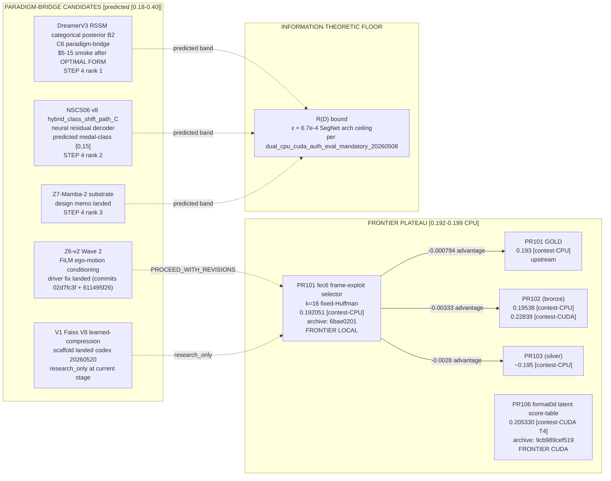
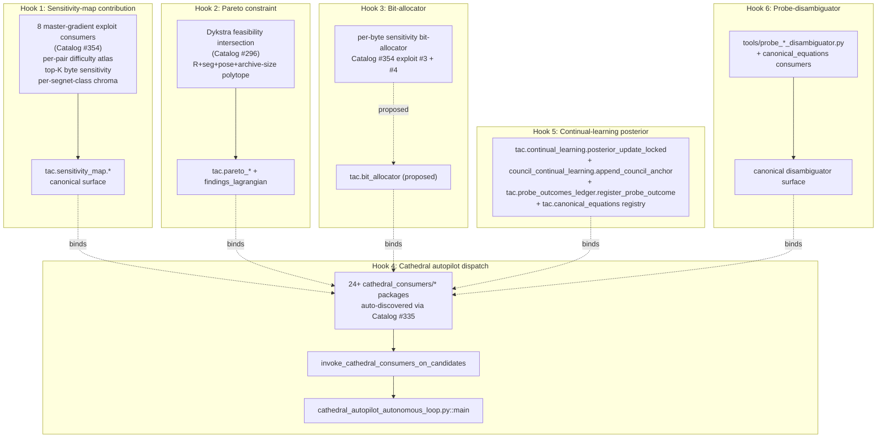
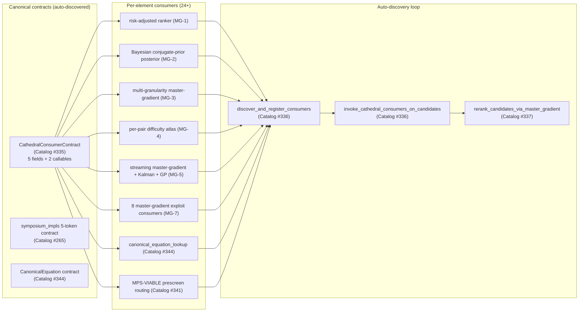
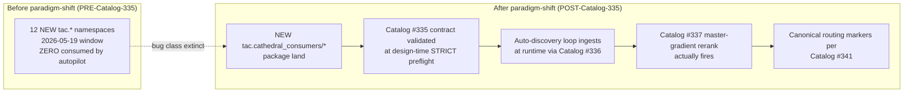

# Strategy Dependency + Wire-in + Hook-Coverage Graph — 2026-05-20T12:00:00Z

> **Deliverable C of T3 grand council symposium 2026-05-20**
> Cite-chain: `council_t3_grand_strategy_review_20260520T120000Z` + `strategy_staircase_synthesis_20260520T120000Z`

## Graph 1 — Substrate-class topology with frontier anchors

## Graph 2 — 6-hook wire-in coverage per Catalog #125

## Graph 3 — Canonical-helper canonical-contract topology (paradigm-shift via Catalog #335)

## Graph 4 — Council deliberation cite-chain topology (last 30d sampled)

```mermaid
graph TD
  THIS["council_t3_grand_strategy_review<br/>20260520T120000Z (THIS)"]

  subgraph "PR #110 lifecycle cite-chain"
    PR110edit["council_t3_pr_110_editorial_positioning_symposium_20260520T050557Z"]
    PR110yousfi["council_t3_pr_110_hnerv_fec6_yousfi_collaborator_impression_plus_hair_splitting_verification_20260520"]
    PR110mg16["council_t3_mg16_voice_tone_style_review_symposium_20260520"]
    PR110final["feedback_t3_council_pr_body_final_recursive_review_landed_20260519"]
    PR110upstream["feedback_t3_grand_council_upstream_contest_compliance_symposium_landed_20260519"]
  end

  subgraph "Paradigm-bridge cite-chain"
    DreamerV3sym["council_t3_dreamerv3_rssm_paradigm_bridge_per_substrate_symposium_20260519"]
    NSCS06v8sym["council_t3_cargo_cult_resurrection_nscs06_v8_variant_c_20260519"]
    C6IBPSv2sym["council_t3_cargo_cult_resurrection_c6_ibps_v2_20260519"]
    NSCS06v8early["council_per_substrate_symposium_nscs06_v8_path_b_20260517"]
    NSCS06v8mid["council_per_substrate_symposium_nscs06_v8_path_b_variant_c_reactivation_20260518"]
  end

  subgraph "Strategy + apparatus cite-chain"
    PathForward["council_t3_path_forward_recalibration_20260519"]
    TierBacklog["council_t3_tier_45_backlog_prioritization_20260519"]
  end

  THIS --> PR110edit
  THIS --> PR110yousfi
  THIS --> PR110mg16
  THIS --> PR110final
  THIS --> PR110upstream
  THIS --> DreamerV3sym
  THIS --> NSCS06v8sym
  THIS --> C6IBPSv2sym
  THIS --> PathForward
  THIS --> TierBacklog
  NSCS06v8sym --> NSCS06v8mid
  NSCS06v8mid --> NSCS06v8early
```

## Graph 5 — Orphan-signal extinction surface (cathedral autopilot)

## Missing edges (gaps identified by symposium)

### MISSING EDGE 1: per-substrate symposium → OPTIMAL FORM iteration

**Problem:** Catalog #325 enforces per-substrate symposium EXISTS within 14 days; Catalog #315 enforces OPTIMAL FORM iteration; but no STRICT gate enforces symposium → iteration → dispatch chain (PROCEED_WITH_REVISIONS verdicts can dispatch).

**Op-routable:** Per Decision 3, refuse paid dispatch on substrates with PROCEED_WITH_REVISIONS verdict at runtime (operator-authorize.py check). Implementation = add to `tools/operator_authorize.py::_dispatch_modal` adjacent to Catalog #313 probe-outcomes check.

### MISSING EDGE 2: per-tier cadence audit → council deliberation proposal gate

**Problem:** `tools/audit_council_tier_cadence.py` exists; it produces OVER_CADENCE alerts; but no STRICT gate enforces consulting it before proposing a new T3 deliberation.

**Op-routable:** Per Decision 2, nominate `tools/audit_council_tier_cadence.py` as pre-deliberation discipline in CLAUDE.md "Council conduct" subsection (does NOT require new gate; behavior-change only).

### MISSING EDGE 3: provenance compliance backfill loop

**Problem:** Catalog #323 currently at 202 violations (down from 543 baseline); 136 MISSING_PROVENANCE + 66 INVALID_PROVENANCE_SHAPE; sweep deprioritized.

**Op-routable:** Per Decision 7, one small subagent session to (a) reclassify state-artifact rows as DERIVED_OUTPUT + emit waivers, (b) fix INVALID_PROVENANCE_SHAPE via one-pass schema fix.

### MISSING EDGE 4: bit-allocator canonical helper (Hook 3)

**Problem:** Catalog #125 Hook 3 (bit-allocator) is referenced in `tac.bit_allocator (proposed)` in canonical helper inventory but not yet a top-level canonical surface; existing per-byte sensitivity sourced from Catalog #354 exploit #3 + #4 doesn't have a dedicated top-level canonical helper.

**Op-routable:** Per Decision 10 (canonical-helper-sister-extension over new-tool), extend existing `tac.master_gradient_consumers` with `bit_allocator_from_per_byte_sensitivity` sister method rather than create new top-level surface.

### MISSING EDGE 5: unified Lagrangian phase 2 wire-in

**Problem:** Findings Lagrangian phase 1-a tests landed; phase 2 (full unified `S_total`) per Decision 5 is the long-term centerpiece but no concrete wire-in cadence.

**Op-routable:** Per Decision 5, nominate 1 subagent per week for 4-12 sessions to mature phase 2; per Decision 6 (consolidation-over-addition), the phase 2 work should SUBSUME existing per-track Lagrangians, not parallel them.
