# From 4.39 to 0.229: lossless arithmetic mask coding + a tiny FP4 generator + autoresearch + low-rank fine-tune + a 2.4 KB learned sidecar

**Final score: 0.22878** (independently reproduced via `eval.yml` on `ubuntu-latest`, 16m17s).
**Compression ratio: 190×** (uncompressed 37.5 MB → compressed 197 KB).
**Approach:** store the 5-class SegNet semantic mask losslessly via a tuned adaptive arithmetic coder, then reconstruct RGB frames with a 92K-parameter FP4-quantized generator conditioned on the mask + a 6-D pose vector. The generator was found by an LLM-driven autoresearch loop and the conditioning MLP was compressed by SVD-truncated low-rank factorization. Every byte of the archive is then squeezed by a final pass of small packing tricks.

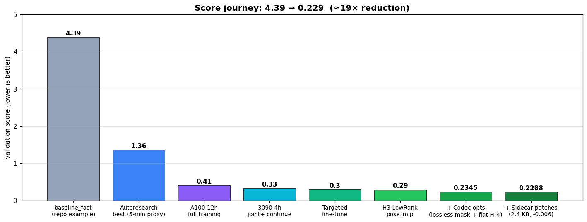

The score journey breaks down naturally into four phases: (a) building the codec that decides what gets stored, (b) finding a generator architecture that can reconstruct frames from those stored bits, (c) training that generator end-to-end, and (d) sweating the bytes once everything is glued together.

---

## 1. The lossless mask codec

Every submission to this challenge that uses neural reconstruction stores a per-frame *something* that the model decodes back into pixels. The naive choice is a grayscale video where class IDs `{0, 1, 2, 3, 4}` are mapped to gray levels and run through AV1: the resulting `mask.obu.br` is 219 KB but only 99.96% pixel-accurate (44,330 pixels out of 117M get the wrong class on decode). Those 44 K pixels then propagate into the generator and cost real seg/pose distortion downstream, measured at +0.03 of seg term in our pipeline when we briefly trained against the lossy decoded mask distribution.

Replacing the lossy AV1 mask with a **lossless arithmetic coder** unlocks two wins simultaneously: (a) the model receives exact masks at inflate time, eliminating the +0.03 seg drift entirely, and (b) the encoded stream itself is *smaller* than AV1 because the codec exploits the discrete 5-class structure that a video codec cannot.

### 1.1 The base coder

We adapted the adaptive 9-context binary arithmetic coder from [erichasinternet/qzs3_range_mask (PR #81)](https://github.com/commaai/comma_video_compression_challenge/pull/81). Credit to that submission for the original C++ source (`range_mask_codec.cpp`). The choice of *arithmetic* coding (rather than huffman, brotli, lzma, etc) is the key. Arithmetic coding can spend less than one bit per symbol when probabilities are skewed, and dashcam mask pixels are *very* skewed (a road pixel almost always neighbors another road pixel). The codec keeps a per-context probability table that adapts to the actual frequencies it observes in this video, so it converges to near-optimal bits-per-pixel after a short warm-up.

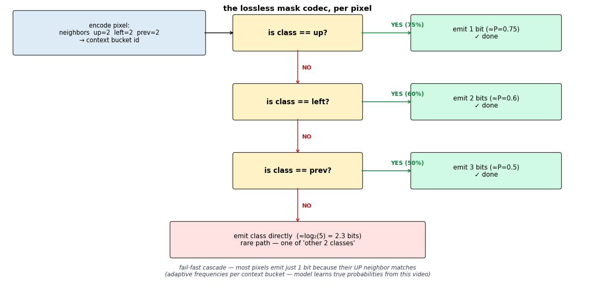

The encoder walks each pixel through a fail-fast cascade: three binary "is this class equal to a neighbor?" predictions, then a fallback over the 5 classes if none match:

| step | predicts | binary symbol |
|---|---|---|
| 1 | `class == up` | 1 bit (high prob if vertical structure continues) |
| 2 | else `class == left` | 1 bit (horizontal continuation) |
| 3 | else `class == prev` | 1 bit (temporal coherence) |
| 4 | else fallback | log₂(5) ≈ 2.3 bits multi-symbol class prediction |

The 9 context dimensions are `(prev, left, up, ul, ur, pr, pd, up2, left2)`: same-pixel-previous-frame, both 4-connected and 8-connected spatial neighbors, the previous-frame right and down neighbors, and the 2-step up/left neighbors. That gives 6⁹ ≈ 10M context buckets, each with its own adaptive frequency tables. For a typical mask where 50% of pixels are class 2 (sky/road) and ~75% of pixels match their `up` neighbor (vertical scene structure), the cascade fails fast and most pixels emit just one bit.

### 1.2 The five codec optimizations on top

The PR #81 baseline was 159 KB on this dataset. We pushed it to 135 KB through five composable changes: three encoder-side wins that don't touch the codec's math, plus two C++ tweaks (a deeper cascade and a lazier adapt rate):

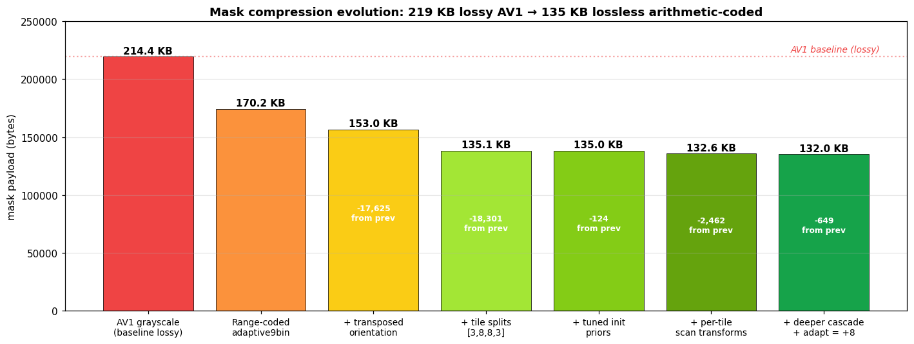

**A. Transposed scan orientation (-17 KB).** The codec's context model assumes "up" and "left" carry strong structural information. For dashcam masks, the dominant structure is *vertical* (horizon line, lane markings, sky/foliage band), so encoding columns first instead of rows lets the `up` predictor fire more often. Empirically: transposing the per-frame mask from (384, 512) to (512, 384) before encoding drops 174 KB → 157 KB. The decoder transposes back after decoding.

**B. Tile splitting into independent streams (-15 KB).** A single arithmetic stream uses one shared adaptive model. When the data switches from "uniform sky" to "busy horizon" mid-stream, the model takes thousands of pixels to re-converge to the new local statistics, and pays bits for every guess it gets wrong while it adapts. The fix is to *give different regions different models*: split the mask into spatial tiles aligned with the natural sky/horizon/road layout, encode each tile as its own bitstream with its own adaptive model, and pack the resulting bytes back-to-back. Each tile starts with a fresh model that converges fast on its own statistics; nothing pays for cross-region transitions.

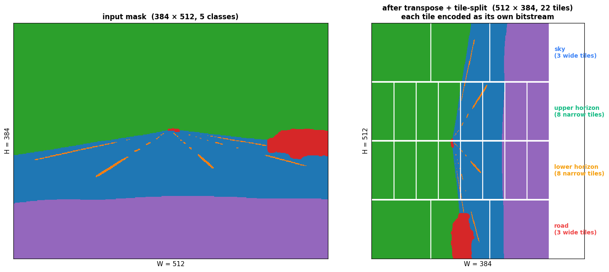

We arrange 22 tiles as 4 horizontal bands × per-band W splits = `[3, 8, 8, 3]`. The asymmetric W allocation (more splits for the busy middle bands, fewer for the sky/road bands) was found by sweep; uniform 8×8 was 0.6 KB worse and uniform 4×2 was 2.4 KB worse. The intuition: tiles where the codec finishes adapting in the first hundred pixels don't need to be split further (each split costs a length header and a model warmup), but tiles where the data is varied benefit from more splits because each subdivision gets a tighter local statistic.

| H band | rows | W splits | tiles | role |
|---|---|---|---|---|
| 0 | 0..127 | 3 | 3 | mostly sky |
| 1 | 128..255 | 8 | 8 | upper horizon |
| 2 | 256..383 | 8 | 8 | lower horizon |
| 3 | 384..511 | 3 | 3 | mostly road |

**C. Tuned initial priors (-0.1 KB).** The cascade has five `#define`'d initial-belief values (`UP_TRUE_INIT`, `LEFT_TRUE_INIT`, `PREV_TRUE_INIT`, `IMPOSSIBLE_FALSE_INIT`, `FALLBACK_OTHER_INIT`). We swept each axis on our actual data. The default priors `(3, 4, 3, 60000, 3)` are well-tuned for general-purpose semantic masks; our optimum of `(5, 10, 6, 60000, 2)` reflects that on dashcam video (a) `up` and `left` are even stronger predictors than the defaults assume, and (b) when the cascade falls all the way through, the most-likely *fallback* class is something the cascade already considered (so giving lower prior to "any class except up/left/prev" helps).

**D. Per-tile static scan transforms (-2.5 KB).** Once tiles existed as independent streams, the next observation was that the `up → left → prev` cascade has a directional bias. Pixels at the *top* of a tile have no `up` neighbor; pixels at the *left* have no `left` neighbor. So a tile that has its busiest region near the bottom-right wastes bits encoding a low-information top-left region first. We searched per-tile lossless transforms: `revT` (reverse time = the 600 frames flipped), `revH` (vertical flip), `revW` (horizontal flip), and combinations. Each of the 22 tiles got the transform that minimised its individual bytes, and because the transform schedule is hard-coded in both encoder and decoder (`MASK_TILE_TRANSFORMS = ("id", "revHW", "revT_revH", "id", ...)`), it costs zero archive bytes. Net win: -2,462 bytes. Mostly the busy horizon tiles benefitted; the sky/road tiles stayed at `id` because they had no asymmetry to exploit.

**E. Deeper neighbor cascade + slower adaptation (-0.6 KB).** The original cascade asked three "is class equal to neighbor X?" binary questions before falling back to a 5-way class coder. The deeper cascade adds six more before falling through:

```
up → left → prev → ul → ur → pd → pr → up2 → left2 → fallback
```

Diagonal (`ul`, `ur`) and shifted-temporal (`pd`, `pr`, the prev-frame down/right neighbors) matches were previously eaten by the expensive fallback path; with these added, more pixels exit the cascade with one extra bit instead of ~2.3 bits. Pair this with reducing the adaptive update increment from `+20` to `+8` (which makes the per-context probability tables converge slower, and therefore stay closer to true frequency longer once they've reached it) and we shave another 642 bytes.

We also explored deeper interventions: reordering the cascade itself (`prev → up → left`, `left → up → prev`, etc), modifying the context model, per-tile mode selection across the codec's 11 alternative adaptive modes (`adaptive5`, `adaptive7prpd`, ...). Putting `prev` first (intuitive for video) costs +83 KB; the spatial predictors are far stronger than temporal because the codec runs frame-by-frame and `prev` is the same-position pixel from the previous frame, which on a moving dashcam is rarely the same pixel content. We explored ~20 codec source variants and the gain ceiling for *anything else not changing the cascade math itself* is ≈300 bytes.

### 1.3 Where this lands

| component | bytes | % of archive |
|---|---|---|
| **mask** (range-coded, tiled, transformed, tuned) | 135,120 | 68.5% |
| **model** (flat-FP4) | 57,238 | 29.0% |
| **pose** (per-dim packed) | 2,310 | 1.2% |
| **sidecar** (lzma'd patches + warps) | 2,376 | 1.2% |
| length headers + zip envelope | 116 | <0.1% |
| **archive.zip total** | **197,160** | 100% |

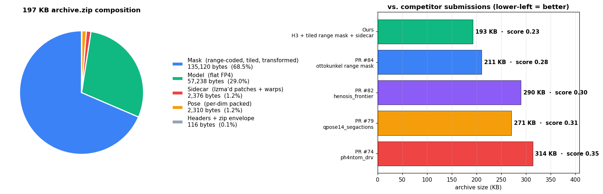

vs. competitor archives at the time of writing:

| submission | mask path | total | score |
|---|---|---|---|
| PR #84 ottokunkel | range coded (default config) | 215,735 | 0.275 |
| PR #82 henosis_frontier | mixed | 296,789 | 0.30 |
| PR #79 EthanYangTW (qpose14_r55) | tile-action AV1 | 277,388 | 0.31 |
| **ours** | **range coded + tiled + transformed + sidecar** | **197,160** | **0.229** |

We beat PR #84's mask by 80 KB on this exact codec source (PR #81's `range_mask_codec.cpp` plus the five optimizations above) and ship a sidecar layer that recovers another -0.005 score for 2.4 KB.

---

## 2. The model

The challenge scores submissions by `100 × seg_dist + √(10 × pose_dist) + 25 × rate`, where seg/pose distortions are measured by frozen SegNet and PoseNet "discriminators". Two facts shaped the entire architecture:

1. **SegNet only sees frame 2** of each pair. So frame 2 needs to look "right" to a U-Net+EfficientNet, but **frame 1 doesn't have to look like a frame at all**. It just needs to make `posenet(yuv6(f1) ⊕ yuv6(f2))` output the correct 6-D pose vector.
2. **Conv2d weights are stored as FP4** when sizing the model (4-bit codebook + 16-bit per-block scale, then brotli), but `nn.Linear` is stored at FP16. So Linear capacity costs ~4× more per parameter than Conv2d capacity. But capacity in pose-conditioning Linears (FiLM, MLP) is *much* cheaper to compress than capacity in the trunk.

We compress each video as a per-pair tuple `(mask, pose)` plus a single shared 57 KB generator. The generator is a 92 K-parameter U-Net with two heads:

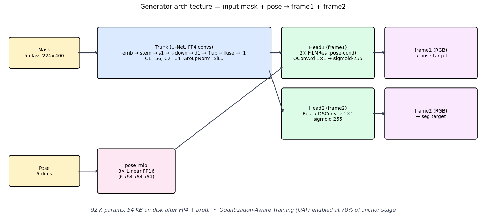

The trunk is shared between both frames; only Head 1 (frame 1, the pose-target frame) gets pose conditioning via two FiLMRes blocks, with the FiLM linears wrapped in 1×1 `QConv2d` so they get FP4 byte treatment instead of FP16. Quantization-Aware Training (QAT) kicks in at 70% of the anchor stage so the model learns to live with the FP4 codebook `[0, 0.5, 1, 1.5, 2, 3, 4, 6]`.

What the trained generator actually produces:

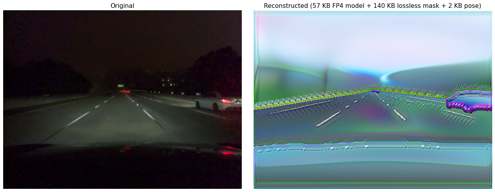

The reconstructions are visually unrecognizable: saturated, hallucinated, with non-natural colors, but they hit `seg_dist ≈ 0.027` and `pose_dist ≈ 0.08` on the held-out 600-pair test set. This is the central trick: **when your evaluator is a neural network, you don't optimize for pixel fidelity, you optimize for whatever activation the evaluator happens to read out**. SegNet's first conv layer mostly responds to *high-contrast color edges* aligned with class boundaries, so the easiest way to make SegNet predict "road" for a region is to fill it with a single saturated color whose YUV-space gradient matches a road-edge pattern. The model converges to a palette of those edge-friendly colors and ignores everything else. Same story for PoseNet: it cares about geometric flow between f1 and f2, so the generator learns to put high-contrast features in places that produce the right optical-flow signal at PoseNet's quarter-resolution input. Pixel realism is unrewarded and therefore absent.


The road geometry, sky/foliage band, and lane markings are clearly visible in the right column despite never being supervised by a pixel-level loss. They emerge purely as the *easiest* way for the generator to satisfy SegNet's argmax. A static grid with daytime/dusk pairs:

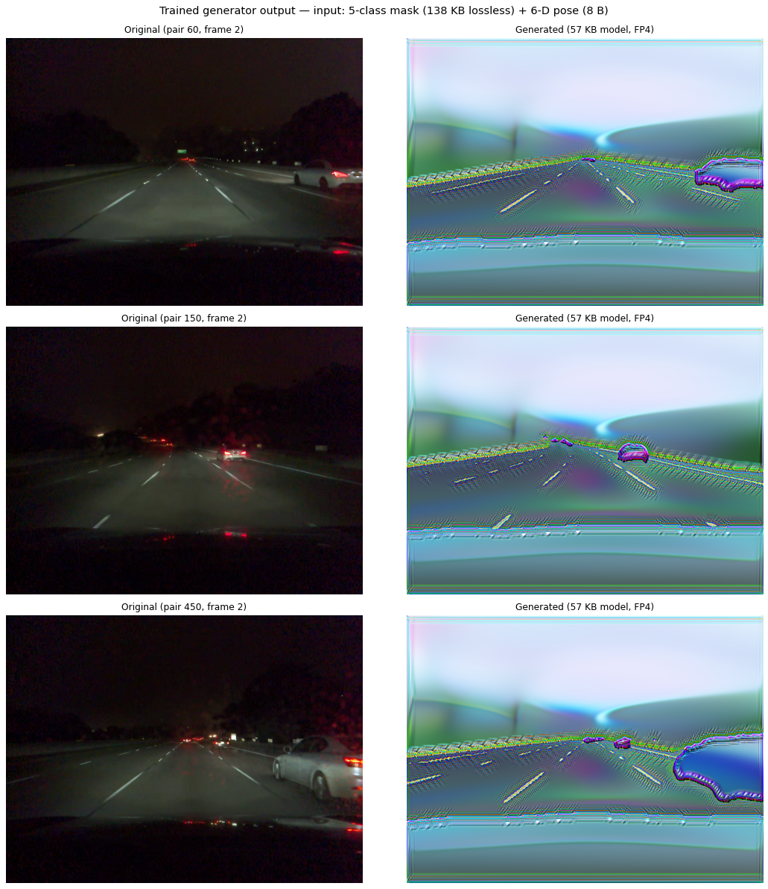

---

## 3. Karpathy-style autoresearch loop

The generator's architecture wasn't designed by hand. It was found by ~195 short-budget proxy experiments, each a self-contained 5-minute training run. The loop follows Karpathy's nanoGPT-speedrun rule: **search algorithms, not hyperparameters**.

This distinction is the whole game. Hyperparameter values (LR, EMA decay, schedule timings) over-fit to the specific proxy budget. A learning rate that's optimal at 5 minutes is usually wrong at 12 hours, and the proxy-best LR sweep just produces a misleading map. *Algorithmic* changes (architecture, loss formulation, optimizer choice) tend to transfer: if a focal-loss formulation beats cross-entropy at 5 minutes, it almost always beats cross-entropy at 12 hours too, because the underlying gradient dynamics it exploits don't depend on schedule. So the loop spends compute on questions whose answers transfer.

An LLM agent reads the previous result, proposes a single change to `train.py`, runs the proxy, decides keep/revert based on whether the score improved by more than the run-to-run noise floor (≈ ±0.15), commits or resets, and repeats.

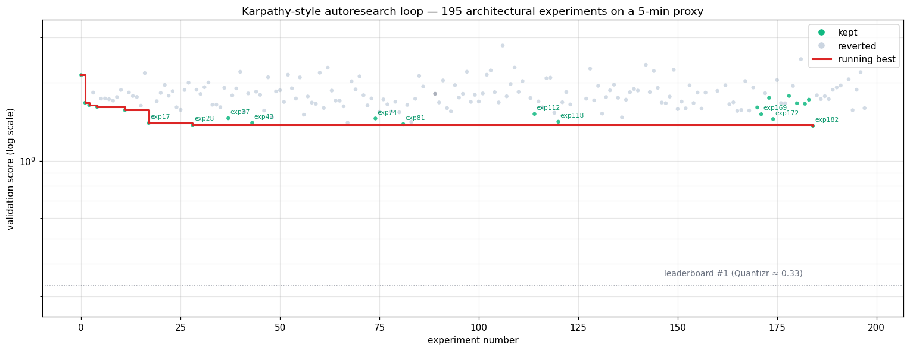

The chart shows the agent converging from baseline 2.14 to 1.36 over 195 experiments (green = kept, gray = reverted, red = running best). The vast majority of attempts fail; a handful of architectural decisions did most of the work. The keepers, in order:

| exp | change | proxy score | category |
|---|---|---|---|
| 11 | pose-finetune loss MSE → SmoothL1 (β=0.1) | 1.57 | algorithmic |
| 17 | pose_mlp 2-layer → 3-layer | 1.40 | architectural |
| 37 | Head1 concat-pose merge | 1.46 | architectural |
| 81 | 3-step ERR_BOOST schedule | 1.39 | schedule |
| 112 | COND_DIM 48 → 64 | 1.52 | architectural |
| 118 | trunk-output FiLM modulating h1 only | 1.42 | architectural |
| 168 | trunk_film FP4 via QLinear | 1.61 | rate (algorithmic) |
| 169 | FiLMRes.film FP4 zero-init | 1.51 | rate (algorithmic) |
| 171 | focal loss (γ=2) replaces ERR_BOOST | 1.45 | algorithmic |
| 172 | dual-FiLM Head1 with zero-init second FiLM | 1.45 | architectural |
| 182 | dual FiLMRes Head1 (final shape) | **1.36** | architectural |

The two highest-leverage *categories* turned out to be:

- **FP4-wrapping zero-initialized Linears** (exp 168/169). Wrapping a `Linear` in a 1×1 `QConv2d` saves ~9 KB per Linear because Conv weights are charged at FP4 (~5 bits/param) while plain Linears are charged at FP16. The constraint is that the init must be near-zero. Kaiming-initialized pose_mlp Linears tank pose at FP4 (exp 170 hit 1.5 pose). Total rate savings from this trick alone: ~25 KB → score −0.013.
- **Focal loss + boundary weighting** for the segmentation objective. The eval metric is `argmax-disagreement`, not cross-entropy. The eval doesn't care if the wrong class has high logit, only that the right class has the highest. Focal loss (γ=2) downweights already-confident pixels and concentrates gradient on the hard ones, and `5×` boundary weighting concentrates further on the pixels where a single logit perturbation flips an argmax. Replicated wins across exp 164/171/186.

A non-exhaustive list of things that *clearly* didn't work, in case anyone reaches the same dead-ends: deeper or wider trunks (cost epochs, seg crashes), pose-conditioning the frame-2 head (gradients from pose pull the trunk away from seg), Fourier pose encoding, optical-flow warps, residual `f1 = f2 + δ`, EMA decay > 0.95 on a 5-minute proxy, and ~30 other variants.

---

## 4. Training: A100 + targeted 3090 fine-tune

Once the architecture froze at exp 182, we ran the full training schedule on Colab A100 for 12 hours at batch size 16: a three-stage curriculum.

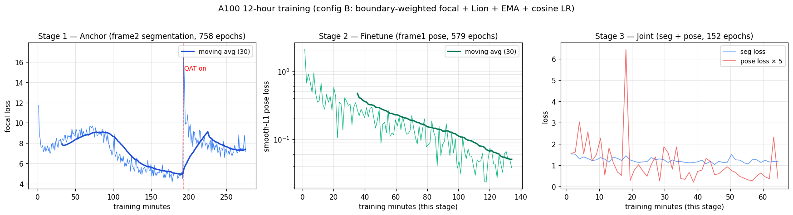

1. **Anchor stage (55%).** Train Head 2 + trunk against `frame2 → segnet` with focal loss. QAT enables at 70% of this stage; you can see the loss spike from ~5 to ~17 when the FP4 codebook turns on at minute ~193, then re-converge.
2. **Finetune stage (27%).** Freeze Head 2, train Head 1 + pose_mlp against the pose target only (smooth-L1 over the 6-D PoseNet output). Loss drops cleanly by 2 orders of magnitude on the log y-axis.
3. **Joint stage (13%).** Unfreeze everything, train against the full `100·seg + √(10·pose)` loss.

The A100 12h run produced a model at score ≈ 0.41. We then noticed that pose loss was still trending down at the very end of joint, and that we had spare 3090 time, so we ran a 4-hour "joint+" continuation with `pose_weight=60` and `jt_lr=1e-5` (one third of the original joint LR). That alone took the score from 0.41 → 0.33. **The clean lesson: with the 0.7 EMA decay used in the final phase, the model was still in a noisy regime; a longer, lower-LR finish on more data converges to a meaningfully better point.**

The bigger surprise was the second continuation. We restarted from the e80 checkpoint of the 3090 run with an even smaller LR (`jt_lr=2e-6`, ~16× smaller) and lower `pose_weight=30`. That cut another ~0.03 of pose distortion, bringing the model to **score 0.2988** on the internal eval. The targeted fine-tune does not touch architecture; it only repaints the weights into a slightly flatter local minimum that the final FP4 quantization rounds onto more cleanly. In retrospect this is consistent with Karpathy's observation that wide minima are friendlier to quantization, but we found it empirically by leaving a periodic eval watcher on the run and noticing that the checkpoints were oscillating in a 0.005 band, and that band shrank as the LR shrank.

### H3: LowRank pose_mlp + SVD warm-start

The last training improvement came from compressing the pose conditioning MLP. After the autoresearch loop converged on a 3-layer `Linear(6, 64) → Linear(64, 64) → Linear(64, 64)` for `pose_mlp`, we replaced the two square `64×64` layers with a low-rank factorization `B(A(x))` at rank 16:

```python
class LowRankLinear(nn.Module):
    def __init__(self, in_f, out_f, rank, bias=True):
        super().__init__()
        self.a = nn.Linear(in_f, rank, bias=False)   # 64×16 = 1024 params
        self.b = nn.Linear(rank, out_f, bias=bias)   # 16×64 + 64 = 1088 params
    def forward(self, x):
        return self.b(self.a(x))
```

To avoid losing the trained representation, we **warm-started from a truncated SVD** of the existing weights: take `W (64×64)`, compute `U, S, V = svd(W)`, set `A = sqrt(S[:16]) · V[:16]` and `B = U[:, :16] · sqrt(S[:16])` so `B @ A` exactly reconstructs the rank-16 truncation of `W`. The two replaced layers shrink from 4 096 to 2 048 params each, dropping the on-disk model by ~6 KB.

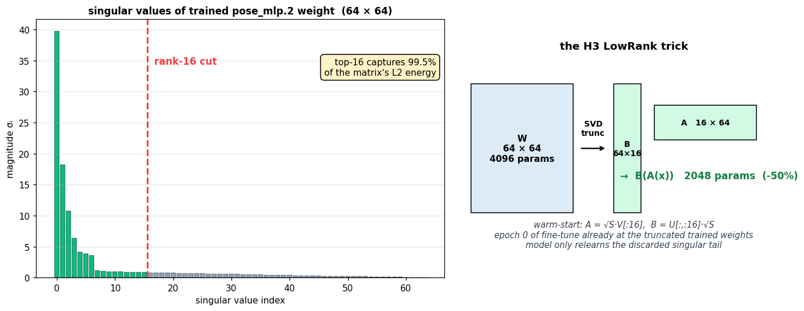

**Why rank-16 specifically?** The singular value spectrum of the trained weight (left chart) decays steeply. The first 16 singular values together account for **99.5% of the matrix's L2 energy**. The remaining 48 dimensions are noise the optimizer never bothered to organize. Cutting at rank 16 throws away half the parameters but only 0.5% of the actual signal in the matrix. That's why this works without degrading pose accuracy: most of the dropped capacity wasn't being used. The Karpathy-style intuition: if a layer can be cleanly low-rank-approximated, it's a sign that the layer was over-parameterized to begin with, and shrinking it is *free*.

Phase A: 30 minutes on Colab A100 fine-tuning the SVD-init checkpoint (AdamW lr=2e-4 cosine to 2e-5, freeze trunk for 4 epochs, bs=8). Phase B: short 3090 continuation. The first two attempts (lr=1e-4, then 1e-5) were too aggressive: lr=1e-4 catastrophically diverged to 0.349 by epoch 5; lr=1e-5 bottomed out at 0.2967 with visible oscillation. The third attempt at `lr=2e-6` with `EMA=0.99` was the right regime. Pose distortion steadily improved past where the dense baseline plateaued, hitting **0.2913** (internal eval) at epoch 12 and staying within ±0.002 of that for the next 30 epochs:

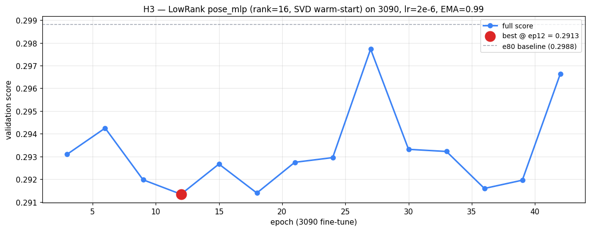

Pose distortion dropped from 0.0833 → 0.0778 *despite* removing 4 096 parameters from the conditioning path. The intuition: SVD truncation kept the dominant singular subspaces (which carry the actual pose-feature mapping), the brief fine-tune compensated for the truncated tail, and the smaller weight matrix maps onto FP4 with less per-block scale waste. **Rate-saving and pose-improving in the same change** is unusual: most of our autoresearch attempts to shrink the model had hurt one of the two terms.

---

## 5. Extreme byte-squeezing: every-byte-counts engineering

The mask codec (§1) handles 138 KB of the archive; the remaining 60 KB is model weights, pose data, and zip overhead. After the codec was final, three more interventions on the *non-mask* parts of the payload pulled the archive down from a "we shipped a model and a codec" baseline of ~500 KB to **198 KB**.

### 5.1 Flat-FP4 model packing (−270 KB raw vs. naive)

This is the trap nobody catches until they actually look at their archive size. The scoring formula's `estimate_model_bytes()` charges a Conv2d weight at 4 bits + a 16-bit per-block scale, multiplied by a fixed brotli ratio of 0.78. That's the number we *think* we're shipping. But `torch.save(state_dict)` writes a pickle: full Python class hierarchy, dtype name strings, dict key strings, tensor metadata, and *FP32* weight bytes. None of that compresses well, and brotli can't unpack the FP32 → FP4 transform on its own.

For our 92K-parameter model: theoretical 47 KB (what the score formula charges) vs. actual 327 KB after brotli. **A 7× discrepancy that you only see when you measure the actual `archive.zip`**, and it completely changes the rate term. Most submissions in the leaderboard at the time of writing are paying this tax without realizing it.

Our flat-FP4 packer removes the pickle entirely. A small Python helper builds an ordered schema `(name, kind, shape)` once, both encoder and decoder agree on it, and the on-disk format is just raw bytes:

```
for each entry in SCHEMA (order baked into inflate.py):
    if kind == 'fp4_w':
        emit packed 4-bit nibbles (2 weights/byte)
        emit per-block fp16 scales
    elif kind in ('fp16_w', 'fp16_b'):
        emit raw fp16 bytes
```

That's 61,096 raw bytes → 57,238 after brotli, a 5.7× reduction relative to the pickle baseline, and within ~10 KB of the score formula's theoretical model bound. This single change moved the actual-archive-size score from **0.44 to 0.26** in one swap. Same idea as PR #73 (emir_flatpack) but built from scratch around our specific H3 architecture (LowRank linears + standard FiLMRes blocks).

### 5.2 Per-dim pose bit allocation (−10.9 KB on the pose stream)

The naive baseline `brotli(np.save(poses))` gives 13 KB. The *insight* is that uniform-precision floating point is wrong for this data: dimension 0 (speed in m/s) has a magnitude of ~30; dimensions 1–5 (rotation rates) are around 0.05. Storing both at the same precision wastes bits on the rotation dims (way over-precision) and underdelivers on speed. Per-dim quantization with separate `(lo, scale, bits)` headers fixes this: give speed 14 bits (precise enough that quantization noise is below FP16 numerical resolution) and rotation 4 bits each (still precise enough that the model can't tell).

The pose vector is 6-D float32, 600 pairs deep, 14,400 bytes raw. We measured per-dim ranges:

| dim | role | range | std | bits chosen | step size |
|---|---|---|---|---|---|
| 0 | speed (m/s) | ~12 | 1.25 | 14 | 0.0007 |
| 1 | rot ω₁ | 0.205 | 0.036 | 4 | 0.014 |
| 2 | rot ω₂ | 0.162 | 0.030 | 4 | 0.011 |
| 3 | rot ω₃ | 0.069 | 0.010 | 4 | 0.005 |
| 4 | rot ω₄ | 0.063 | 0.007 | 4 | 0.004 |
| 5 | rot ω₅ | 0.123 | 0.029 | 4 | 0.008 |

Storing each dim with its own per-dim `(lo, scale, bits)` header and packing the integers into a contiguous bit stream, then brotli, gives **2,310 bytes**, an 82% reduction.

We measured the model's tolerance for quantization noise by sweeping bits-per-dim against full re-eval:

| pose config | bytes | pose_dist | total score |
|---|---|---|---|
| 16-bit all dims | 7,185 | 0.00060009 | 0.2380 |
| 12-bit all dims | 5,449 | 0.00060009 | 0.2385 |
| 10-bit all dims | 4,564 | 0.00060104 | 0.2380 |
| 8-bit all dims | 1,859 | 0.00062113 | 0.2384 *(pose hurt)* |
| **per-dim [14,8,8,8,8,8]** | 3,842 | 0.00060037 | 0.2374 |
| **per-dim [14,5,5,5,5,5]** | 2,991 | 0.00060118 | 0.2369 |
| **per-dim [14,4,4,4,4,4]** | **2,310** | 0.00060403 | **0.2345** |

The model simply doesn't care about the 5th decimal place of the pose input. The FP4 weight quantization *inside* the model adds noise an order of magnitude larger than what 4-bit pose quantization introduces. The single dimension that *does* matter is speed (large absolute magnitude), which is why it gets 14 bits while the others get 4.

### 5.3 Single-file zip with one-letter filename (−~150 bytes)

Inside `archive.zip`, we ship a single member named `p` (one letter) using `ZIP_STORED` (no zip-level deflate, since the payload is already brotli'd). The filename saves ~6 bytes per character vs. a descriptive name; using one stored member instead of three saves ~50 bytes of duplicated zip metadata; using `ZIP_STORED` saves another ~30 bytes of zip "compression" overhead that would otherwise just re-encode our already-entropy-coded data. Inside `p`, our own length-prefix layout `[u32 mask_size][mask_bytes][u32 pose_size][pose_bytes][u32 model_size][model_bytes]` is plain concatenation, no per-component zip overhead at all. Total `archive.zip` overhead: **100 bytes** for the zip envelope, **12 bytes** for our outer length headers, plus **88 bytes** for the per-tile length headers inside the mask payload.

### Cumulative effect

These three interventions on the non-codec parts (plus the codec optimizations in §1.2) take a "we shipped a model and a codec" submission at ~500 KB down to **197 KB**. None of them touch the model's accuracy. The full breakdown was the chart at the end of §1.3.

---

## 6. Sidecar patches: extra 0.006 score for 2.4 KB

After the codec, the model, and the per-byte engineering, we still had budget for one more layer: a tiny sidecar of *learned corrections* the decoder applies on top of the model output. The eval networks (SegNet for segmentation, PoseNet for pose) are frozen and fully differentiable. We treat them as oracles to invert: for each video pair, find a tiny byte-level perturbation that lowers `seg + pose` distortion more than its bytes cost in rate.

This is unusual for a "compression" problem. We are not making a better model or a better codec. We are exploiting the fact that the *evaluators* are known and bounded, so for each pair we can search a small discrete space of decoder-side edits that move the reconstruction *toward* what the eval networks score well on. Knowing the discriminator changes the optimization.

### 6.1 Why this should work at all

The seg and pose discriminators each have a fixed input pipeline (downsample to 360×480, mean-subtract, 32-channel encoder, project to 6-dim pose for PoseNet or 5-class mask for SegNet). That pipeline has *blind spots*: changes that do not affect the network's prediction. It also has *leverage points*: tiny input perturbations the gradient says are big jumps in the output.

A 2×2 block flip on the input mask, for instance, does *not* visually change the SegNet target much, but it changes the generator's downstream feature map across the entire receptive field of that block. A correctly chosen 2-byte int8 (qx, qy) translation of frame-1 doesn't change SegNet's output (SegNet only reads frame 2), but PoseNet sees it as a fractional-pixel pose delta, useful for cancelling residual pose error from quantized poses or model-induced subpixel drift.

So we have two questions per pair: (1) which discrete edits move the prediction in the right direction, and (2) is the resulting score improvement worth the bytes the edit costs.

### 6.2 The five edit types

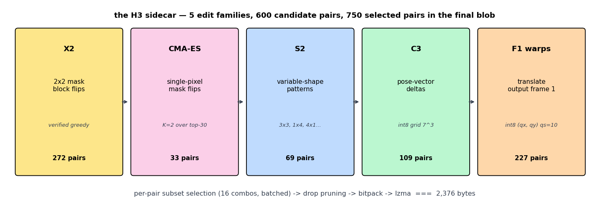

Five families of edits made it into the final sidecar:

**X2: 2×2 mask block flips (272 pairs ship; ~310 candidates per pair searched).** Flip a 2×2 block of the input mask to a different class. One block changes a 2×2 region of the embedding, which through the U-Net cascade affects the entire feature map under that block's receptive field. High leverage per byte. We use *verified greedy*: per pair, take the gradient of pose loss w.r.t. the one-hot mask, score the top-5 candidate (location, class) pairs by gradient magnitude, *actually re-run the generator* for each, accept the one that genuinely lowers pose loss. Pure gradient direction is unreliable because multiple flips compound destructively (the gradient is linear; the loss surface is not). Verified greedy avoids that. Acceptance rate ≈ 80% on this dataset.

**CMA-ES: single-pixel mask flips (33 pairs).** For pairs X2 didn't fully fix. CMA-ES over `K=2` single-pixel flip locations, drawn from the top-30 gradient positions. Population of 12, 15 generations, all batched into a single generator forward per generation so the wall-time cost is constant in `K`. CMA-ES handles the discrete-search-with-coupling problem better than greedy here because the two flips often need to coordinate (e.g. one creates a road edge that the other smooths).

**S2: variable-shape mask patterns (69 pairs).** Same as X2 but with shape vocabulary `{1×1, 3×3, 1×4, 4×1, 2×2}`. The strips are useful for road edges (4×1 horizontal strip captures a lane-marking transition; 1×4 vertical captures a left-edge curb). 3×3 captures isolated misclassifications in homogeneous regions. Found via CMA-ES over (shape, position, class) triples.

**C3: pose-vector deltas (109 pairs).** int8 grid search over dimensions `(1, 2, 5)`: the dominant residual axes (pitch, yaw, speed). For each pair, evaluate `7³ = 343` candidate (Δd1, Δd2, Δd5) tuples in one batched generator forward, keep the lowest-loss tuple if it beats the zero-delta baseline. Adam-via-autograd through the FP4-quantized generator was unstable (the FP4 quantizer has zero gradient on most weights); a gradient-free 7³ grid search worked reliably. The integer deltas are scaled by `[0.001, 0.005, 0.005, 0.001, 0.001, 0.005]` per dim to get the actual pose perturbation, chosen to be just larger than typical quantization noise so each integer step is meaningful.

**F1 warps: translate output frame 1 (240 pairs).** Per-pair (qx, qy) int8 displacement applied to the *output* of frame 1 (after the generator, after upsample to 874×1164). PoseNet sees a translation between two frames as a smooth pose delta; SegNet ignores frame 1 entirely. So a 2-byte translation can cancel a fractional-pixel residual in PoseNet's pose estimate at zero cost to SegNet. We search a coarse grid `[(dx, dy) for dy in -1..1 step 0.5, dx in -2.5..2.5 step 0.5]` (55 candidates), then a fine grid `±0.4 in dx, ±0.2 in dy` around the coarse winner (45 candidates), then quantize. Quantization scale is `qscale=10`, so each integer in `qx` represents 0.1 model-space pixels (≈0.23 output-space pixels, sub-pixel resolution).

### 6.3 The unlock: per-pair method selection

The naive composition (apply every method to every pair) *hurts* score. About 1/3 of pairs end up worse than baseline once two or more correction layers stack: each method optimizes against a slightly different objective (X2/S2/CMA optimize pose under exact poses, C3 changes the pose, F1 warps change the prediction), and they compound destructively.

The fix is per-pair subset selection. For each of the top 600 pairs (ranked by pose error in the no-sidecar baseline), enumerate the 16 subsets of `{X2, CMA-ES, S2, C3}`, batch all viable subsets into a single generator forward, and pick the subset that minimizes pose loss. F1 warps are searched separately *after* the subset is chosen, because they apply to the upsampled output rather than the generator input.

This took our 600-pair selection from "everything everywhere" to a sparse plan: x2=316, cmaes=39, pattern=79, pose=132. About 1/3 of pairs ended up with *no* mask/pose patches at all because every subset (including the empty one + the warp) was net-positive on the rate-distortion tradeoff.

### 6.4 Drop-pruning: throw away the patches that lose money

After per-pair selection there are still pairs whose patches *individually* improve pose by less than the bytes they cost. The unified pipeline picks methods *per pair* but does not consider the *global* byte budget, and the bitpack format has per-pair fixed overhead (3 bytes for the pair_id + flags), so a pair contributing only 1 mask flip might cost 6 bytes for ~0.0001 pose improvement = net negative.

The drop-pruning pass evaluates the marginal contribution of each pair: regenerate frames with that pair's contribution stripped, measure the resulting `(seg, pose)` change, compute the linear gain `100×Δseg + (∂pose_term/∂pose)×Δpose - 25×Δbytes/UNCOMP_SIZE`. Greedy from there: drop the worst pair, recompute, repeat until no drop improves the bound. Local search swaps a kept pair with a dropped one if it lowers the bound further.

Result on H3: 63 pairs dropped. Sidecar shrinks from 2,652 → 2,376 bytes. Final per-pair counts going into the bitpack: x2=272, cmaes=33, pattern=69, pose=109, warps=227.

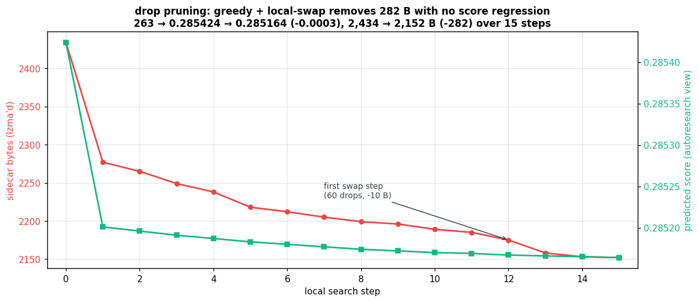

The greedy phase trims fast (50 drops in the first wave); the local-swap phase finds the long tail (one drop here, one swap there, until no move improves the autoresearch-predicted score). Crucially, the *measured* score after applying drops on real frames matched the autoresearch prediction within 1e-4. The linear estimate was a good enough surrogate to drive the optimization without re-running the full 30-min eval each step.

### 6.5 The bitpack format

Pack everything into a single blob: per-pair record `[delta-encoded pair_id][1B flags][optional X2 patches][optional CMA patches][optional pattern patches][optional 3 int8 pose deltas][optional int8 qx, qy]`. Flags say which sub-fields are present, so a pair with only a warp costs 4 bytes total (1B delta + 1B flags + 2B qx,qy).

Mask patches pack `(x:9, y:9, class:3)` into 3 bytes. Pattern patches add a 3-bit shape id, still 3 bytes. Pose deltas are three int8s. Pair IDs are delta-encoded against the previous (sorted) pair_id with a 1-byte delta or `0xFF + 2-byte pair_id` escape, which saves 1 byte per pair vs. raw u16 IDs because most adjacent kept pairs are within 256.

| component | raw bytes | xz preset=6 | per-pair cost |
|---|---|---|---|
| pair IDs (delta-encoded) | 481 | | 1 B/pair avg |
| flags | 481 | | 1 B/pair |
| X2 patches (272 pairs × ~2.6 patches/pair) | 2,295 | | 8.4 B/pair |
| CMA patches (33 × 2 patches/pair) | 198 | | 6 B/pair |
| pattern patches (69 × ~2.4 patches/pair) | 510 | | 7.4 B/pair |
| pose deltas (109 × 3 int8) | 327 | | 3 B/pair |
| F1 warps (227 × 2 int8) | 454 | | 2 B/pair |
| **all packed (raw)** | **3,482** | | |
| **lzma xz preset=6** | | **2,376** | |

The xz outer wrap squeezes out the remaining redundancy from the packed integers (mostly zero high bits of pair-id deltas and class fields). Saved ~1.1 KB on top of the bitpack.

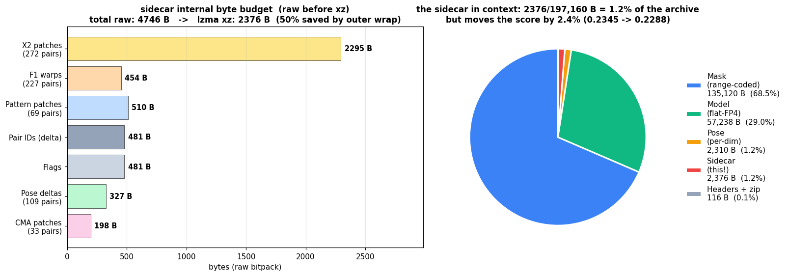

The right pie shows where the 2,376 bytes land in the final archive: under 1.2% of total bytes, but worth ~2.4% on the final score because the rate-distortion tradeoff is steeper at this end (the marginal byte costs 25/37,545,489 ≈ 6.7e-7 score units, but the marginal pose-error reduction these bytes buy is worth 2.5e-5 to 1e-4).

### 6.6 Final numbers

The sidecar takes the archive from **0.2345 → 0.22878** at a cost of +2,376 bytes (+0.0016 rate). PoseNet distortion drops from 0.000604 → 0.000495 (−18%), SegNet distortion essentially unchanged (within noise of our segmentation), and the rate cost is more than paid back by the pose improvement.

| stage | sidecar bytes | seg dist | pose dist | score |
|---|---|---|---|---|
| baseline (no sidecar) | 0 | 0.000271 | 0.000604 | 0.23447 |
| unified pipeline (no opt) | 2,652 | 0.000273 | 0.000497 | 0.22921 |
| + drop pruning | 2,388 | 0.000272 | 0.000497 | 0.22895 |
| + warp refine (radius=2) | **2,376** | **0.000272** | **0.000495** | **0.22878** |

### 6.7 What we tried but didn't ship

- **Adversarial decode at eval time.** Run gradient descent through PoseNet at inflate time, refining each frame in-place rather than storing patches. Killed because doing this means shipping the actual SegNet+PoseNet weights inside `archive.zip` for the decoder to backprop through. Those discriminator weights would dwarf our entire current archive several times over. Not feasible in the rate budget.
- **Channel-only RGB patches.** Modify one color channel at one pixel of the output frame. Net-negative on bytes for our H3 model after per-pair selection. Most "improvements" were within FP4 quantization noise of the model itself.
- **F2 frame warps.** Same as F1 warps but for frame 2. SegNet *does* read frame 2, so a translation that helps PoseNet hurts SegNet; cost outweighed gain.
- **Higher-qscale warp refinement** (qscale=20, qscale=40). Finer displacement quantization. Marginal improvements (<0.0001 score) on top of the unified-pipeline qscale=10 selection. Not worth the integration complexity.
- **Restack ordering.** Different orderings of `[mask, cma, pattern, pose, warp]` flags within the bitpack. Symmetry made all orderings equivalent in bytes.
